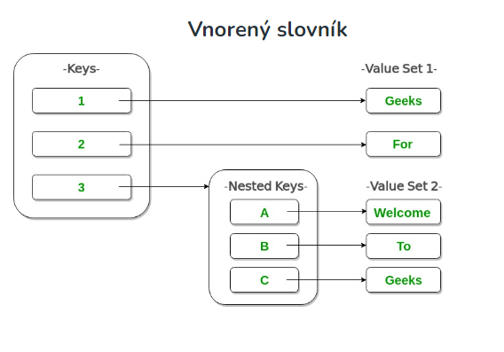

# Slovník (Dictionary) 

V Pythone je slovník **kolekcia**, ktorá nám umožňuje ukladať dáta v tvare párov **kľúč : hodnota** (key:value) . Funguje tiež podobne ako zoznam, **rozdieľ oproti zoznamu je však v tom, že k dictionary nepristupujeme len pomocou indexov, ale aj na základe klúčov** ktoré môžu byť rôznych  dátových typov . **Klúč** slovníka tu predstavuje **index**. Na poradí jednotlivých položiek v slovníku pritom nezáleží. **Slovník je kolekcia, ktorá je neusporiadaná, meniteľná a indexovaná.**

Údaje v kolekcii sú uložené speciálnym spôsobom, tzv. [hashovaním](https://en.wikipedia.org/wiki/Hash_function) t.j. mechanizmom informatiky, ktorý umožňuje rýchlejšie vyhľadávanie objektov v pamäti počítača. To nám umožňuje pristupovat k prvkom kolekcie pomocou klúča omnoho rýchlejšie, ako keby sme ich vyhľadávali napr. v obyčajnom zozname. V zozname je totiž potrebné všetky prvky prejisť a kontrolovať, či
náhodou vlastnosť daného prvku nezodpovedá tomu, co hľadáme. Dictionary resp. slovník dokáže na prvok kolekcie siahnuť omnoho rýchlejšie vďaka výpočtu tzv. hashe (otlačku). Môžeme si to predstaviť tak, že máme prvky v obyčajnomm zozname. Nie sú však usporiadané bezprostredne za sebou a nemajú vôbec využité žiadne indexy. Finta hashovania spočíva v tom, že z klúča sa zistí index prvku pomocou hashovacej funkcie. Ak budeme mať napr. v slovníku uložených zamestnancov a klúčom bude ich meno, hashovacia funkcia nám z "Jan Novák" vráti např. hodnotu 114. Keď siahneme na 114. prvok, tak je tam Jan Novák. A slovník pritom vôbec nemusíme iterovat t.j. postupne prechádzať od prvka k prvku a porovnávať či sme narazili na hodnotu ktorú hľadáme napr. reťazec "Jan Novák".

Slovník deklarujeme rovnako ako zoznam. Hlavný rozdiel spočíva v tom, že používame zložené zátvorky { } a musíme k položkám definovat i ich klúče. K tomu používame **operátor dvobodky :**. Slovníky sú teda používané k **uloženiu hodnôt v pároch klúč:hodnota (key:value)**. Prvkom kolekcie na rozdiel od iných typov dvojica.
~~~
oblubeneVeci= {
    'Jan Novak':'114',
    'homer': 'siska',
    'marge': 'truba',
    'bart': 'prak',
    'lisa': 'saxofon',
    'maggie': 'cumlik'
}
~~~
Zápis položiek sme úmyselne rozdelili kvôli prehľadnosti do viacerých riadkov, ale môže sa to zapísať aj v jednom. V našom slovníku máme šesť hodnôt: '114','siska',
'troba', 'prak', 'saxofon','cumlik'. Každá hodnota patrí nejakému klúču ('Jan Novak','homer', 'marge', 'bart','lisa' a 'maggie'). Hodnoty priradíme ku klúču pomocou dvojbodky (:) a oddelujeme ich čiarkou, ktorá sa vetšinou píše aj za poslednú položku.

**Poznámka:** Kľúče slovníka musia byť nemenné, ako sú napr. n-tice (tuple), reťazce, celé čísla atď. **Ako kľúče nemôžeme použiť meniteľné objekty**, ako sú napr. zoznamy a pod. V kľúčoch slovníka sa rozlišujú malé a veľké písmená, s rovnakým názvom, ale s rôznymi prípadmi kľúča sa bude zaobchádzať odlišne. 
Pre prácu so slovníkom platí to isté, čo sme si ukazovali pri zozname:

~~~
oblubeneVeci= {
    'Jan Novak':'114',
    'homer': 'siska',
    'marge': 'truba',
    'bart': 'prak',
    'lisa': 'saxofon',
    'maggie': 'cumlik'
}
print("Homer má rád " + oblubeneVeci['Jan Novak'])
~~~
Namiesto zápisu oblubeneVeci[0] sme použili klúč typu string. Veľkou **výhodou použitia slovníku je lepšia čiteľnosť**, kedy priamo vidíme, akú hodnotu ze slovníka dostávame. Zatiaľ čo u číselných indexov možno ani nevieme, o akú hodnotu ide. **Každý klúč musí byť unikátný**, ale **hodnoty za nim** také už nemusia byť t.j. môžu sa v kolekcii **opakovať*. Páry klúč:hodnota môžu byť akékoľvek nemenné datové typy. Ak definujeme rovnaký klúč v tom istom slovníku viac krát a s rôznymi hodnotami, bude klúču priradený posledná hodnota.

># Operácie nad slovníkom

# Vytvorenie slovníka
Na vytváranie slovníkov môžeme použiť aj funkciu Pythonu dict(). Patrí k vstavaným funkciám ktorých zoznam najdeme [tu](https://www.w3schools.com/python/python_ref_functions.asp).
~~~
# Vytvoríme slovník obsahujúci osobné informácie

x = dict(name = "Ján", age = 36, country = "Slovakia")

~~~
Zložitosti pri vytváraní slovníka:
Časová zložitosť: O(len(diktát))

Zložitosť priestoru: O(n)

~~~
# Creating a Nested Dictionary

# as shown in the below image

Dict = {1: 'Geeks', 2: 'For', 3: {'A': 'Welcome', 'B': 'To', 'C': 'Geeks'}}

print(Dict)
~~~

# Pridávanie položiek
Do slovníku môžeme jednoducho pridať ďalšie položky priradením nových kĹúčov: 
~~~
oblubeneVeci= {
    'homer': 'sisky',
    'marge': 'truba',
    'bart': 'prak',
    'lisa': 'saxofon'
}

oblubeneVeci['maggie'] = 'dudlik'
print("Homer má rád " + oblubeneVeci['homer'])
print("Maggie má ráda "+oblubeneVeci['maggie'])
~~~
Na pridanie položiek do slovníka môžeme však použiť aj metódu update() .Rovnakým spôsobom môžeme modifikovať už uložené hodnoty.

# Zisťovanie počtu položiek
Pre zistenie počtu položiek v dictionary opäť použijem globálnu (lebo je všeobecne použitelná) funkciu len() ktorú poznáme už aj zo zoznamov a množín.
~~~
oblubeneVeci= {
    'homer': 'sisky',
    'marge': 'truba',
    'bart': 'prak',
    'lisa': 'saxofon'
}
print('Počet položek: %d' % (len(oblubeneVeci)))
~~~

# Prístup k položkám slovníka
K hodnote položky v slovníku môžeme pristupovať umiestnením kľúča do hranatých zátvoriek alebo použitím metódy get() ktorej sa venujeme v ďalšej kapitole.
~~~
country_capitals = {
  "United States": "Washington D.C.", 
  "Italy": "Rome", 
  "England": "London"
}
print(country_capitals["United States"])  # Washington D.C.

print(country_capitals["England"]) # London
~~~
> ### Prístup k prvku vnoreného slovníka
Ak chcete získať prístup k hodnote ľubovoľného kľúča vo vnorenom slovníku, použite syntax indexovania [].
~~~
# Creating a Dictionary

Dict = {'Dict1': {1: 'Geeks'}, 'Dict2': {'Name': 'For'}}

# Accessing element using key
print(Dict['Dict1'])
print(Dict['Dict1'][1])
print(Dict['Dict2']['Name'])
~~~

# Zmena hodnoty prvku
Keďže slovníky Pythonu sú meniteľné, hodnotu prvku slovníka môžeme zmeniť odkazom na jeho kľúč. Napríklad takto:
~~~
country_capitals = {
  "United States": "New York", 
  "Italy": "Naples", 
  "England": "London"
}

# change the value of "Italy" key to "Rome"
country_capitals["Italy"] = "Rome"

print(country_capitals)
~~~
# Odstránenie položky zo zoznamu
Na odstránenie položky zo slovníka používame príkaz del. Napríklad:
~~~
country_capitals = {
  "United States": "New York", 
  "Italy": "Naples" 
}

# delete item having "United States" key
del country_capitals["United States"]

print(country_capitals)
~~~
Na odstránenie položky zo slovníka môžeme obdobne použiť aj metódu pop(), ale ak potrebujeme odstrániť všetky položky zo slovníka naraz, môžeme použiť metódu clear().

# Zistenie existencie určitého klúča v slovníku
Pomocou operátora **in** sa spýtame či slovník obsahuje daný kľúč. Nekontroluje sa ale či existuje alebo neexistuje nejaká hodnota.
~~~
oblubeneVeci= {
    'homer': 'sisky',
    'marge': 'truba',
    'bart': 'prak',
    'lisa': 'saxofon'
}
simpson = input("Ahoj, zadaj svojeho oblúbeného Simpsona (z rodiny Simpsonov): ")
if simpson in oblubeneVeci:
    print("%s má rád %s." % (simpson.lower(), oblubeneVeci[simpson]))
else:
    print("Ale, toto nie je Simpson!")
~~~
# Iterácia cez slovník
 Slovník je usporiadaná kolekcia položiek čo znamená to, že **slovník zachováva poradie svojich položiek**.

Môžeme iterovať cez slovníkové klávesy jeden po druhom pomocou cyklu [for](https://www.programiz.com/python-programming/for-loop) .
~~~
country_capitals = {
  "United States": "New York", 
  "Italy": "Naples" 
}

# print dictionary keys one by one
for country in country_capitals:
    print(country)

print("----------")

# print dictionary values one by one
for country in country_capitals:

    capital = country_capitals[country] # zapis hodnoty do premennej

    print(capital)
~~~

># Funkcie resp. metódy nad slovníkom

Podobne ako tomu bolo pri zoznamoch aj pre slovníky existuje niekoľko dostupných metód. Pozrime sa na tie najdôležitejšie.

# get()

Metóda get() ponúka ďalší spôsob na získanie položky zo slovníka. Hlavnou výhodou tejto metódy je to, že nevyhodí žiadnu výhradu (požiadavku na zadefinovanie výnimky) v prípade, že sa hľadaný klúč v slovníku nenachádza. Miesto toho vráti hodnotu s názvom **None** (že neexistuje) alebo niektorú východziu hodnotu, specifikovatelnú v druhom parametri ktorý možno pridať.
~~~
oblubeneVeci= {
    'homer': 'sisky',
    'marge': 'truba',
    'bart': 'prak',
    'lisa': 'saxofon'
}
print(oblubeneVeci.get('homer'))
print(oblubeneVeci.get('krusty'))
print(oblubeneVeci.get('krusty', 'nikdo'))
~~~

# values(), keys() a items()
Pomocou týchto metód môžeme previesť slovník (dictionary) na zoznam (list). Môžeme tak vyčleniť hodnoty, klúče alebo dokonca môžeme vytvoriť zoznamy n-tic (tuple) párov klúč-hodnota.
~~~
oblubeneVeci= {
    'homer': 'sisky',
    'marge': 'truba',
    'bart': 'prak',
    'lisa': 'saxofon'
}
print(oblubeneVeci.values())
print(oblubeneVeci.keys())
print(oblubeneVeci.items())
~~~
# clear()
Ako naznačuje smamotný názov, tak táto metóda "vyčistí" všetky položky zo slovníka.

Syntax: dictionary.clear()

Parametre: metóda clear() neberie žiadne parametre

Návratová hodnota: metóda clear() nvracia žiadnu hodnotu

~~~
# dictionary
numbers = {1: "one", 2: "two"}

# removes all the items from the dictionary
numbers.clear()

print(numbers)

# Output: {} t.j. metóda nám vrátila prázdny slovník s názvom numbers
~~~

# pop()
Odstráni a vráti položku zo slovníka s daným klúčom (key-om).

Syntax: dictionary.pop(key[, predvolené])

Parametre: metóda pop() má dva parametre \
*   **key** - kľúč, ktorý sa má vyhľadať na odstránenie
*   **default** - hodnota, ktorá sa má vrátiť, keď kľúč nie je v slovníku

Návratová hodnota: metóda pop() vracia:
* Ak key sa nájde - odstránený/vyskočený prvok zo slovníka
* Ak key sa nenájde - hodnota zadaná ako druhý argument (predvolené)
* Ak key sa nenájde a nie je zadaný predvolený argument - KeyError vyvolá sa výnimka
~~~
# create a dictionary
marks = { 'Physics': 67, 'Chemistry': 72, 'Math': 89 }

element = marks.pop('Chemistry')

print('Popped Marks:', element)

# Output: Popped Marks: 72
print('The rest of dictionary is:', marks)
~~~
Príklad na výber prvku ktorý sa v slovníku nenachádza:
~~~
# random sales dictionary
sales = { 'apple': 2, 'orange': 3, 'grapes': 4 }

element = sales.pop('guava')
# KeyError: 'guava'
~~~
Príklad na výber prvku ktorý sa v slovníku nenachádza keď je zadaná predvolená hodnota:
~~~
# random sales dictionary
sales = { 'apple': 2, 'orange': 3, 'grapes': 4 }

element = sales.pop('guava', 'Kľúč guava neexistuje v slovníku sales')

print('The popped element is:', element)
print('The dictionary is:', sales)
~~~
Ako vidieť v príkade vyberaný ból prvok kľúčom "guava" ktorý sa v dictionary nenachádzal. Pretože pri jeho výbere bola zadaná predvolená hodnota resp. text "Kľúč guava neexistuje v slovníku sales", bude zobrazený práve tento text.

# popitem()
Metóda Python popitem() odstráni a vráti posledný pár prvkov (kľúč>:hodnota) vložený do slovníka

Syntax: dict.popitem()

Parametre: metóda dict.popitem() neberie žiadne parametre

Návratová hodnota: Táto metóda sa vráti [plytkú kópiu](https://www-programiz-com.translate.goog/python-programming/shallow-deep-copy?_x_tr_sl=en&_x_tr_tl=sk&_x_tr_hl=sk&_x_tr_pto=wapp) slovníka. Nezmení pôvodný slovník.
~~~
person = {'name': 'Phill', 'age': 22, 'salary': 3500.0}

# ('salary', 3500.0) is inserted at the last, so it is removed.
result = person.popitem()

print('Return Value = ', result)
print('person = ', person)

# inserting a new element pair
person['profession'] = 'Plumber'

# now ('profession', 'Plumber') is the latest element
result = person.popitem()

print('Return Value = ', result)
print('person = ', person)
~~~
Poznámka : Ak je slovník prázdny metóda popitem() vyvoláva chybu KeyError .

# update()
Metóda update() aktualizuje daný slovník pridaním prvkov z iného slovníka alebo z iterovatelných párov kľúč:hodnota.

Syntax: dict.update([other])

Parametre: Metóda update() používa slovníky ako celky alebo iterovateľný objekt párov kľúč:hodnota (vo všeobecnosti [n-tice](https://www-programiz-com.translate.goog/python-programming/tuple?_x_tr_sl=sk&_x_tr_tl=en&_x_tr_hl=sk&_x_tr_pto=wapp) ).
Ak sa update() zavolá bez zadania parametrov, slovník zostane nezmenený.

Návratová hodnota: update()metóda aktualizuje slovník s prvkami z iného slovníka alebo iterovateľného objektu párov kľúč:hodnota.

Nevracia žiadnu hodnotu iba uskutoční zlúčenie a preto ju nemožno priradiť ani nejakej premennej (vracia None).
~~~
marks = {'Physics':67, 'Maths':87}
internal_marks = {'Practical':48}

marks.update(internal_marks)

print(marks)
# Output: {'Physics': 67, 'Maths': 87, 'Practical': 48}

zlucenie = marks.update(internal_marks)
print(zlucenie)
~~~
Fungovanie funkcie update():
~~~
d = {1: "one", 2: "three"}
d1 = {2: "two"}

# updates the value of key 2
d.update(d1)

print(d)
# Výstup: {1: 'jeden', 2: 'dva'}

d1 = {3: "three"}

# adds element with key 3
d.update(d1)

print(d)
# Výstup:{1: 'jeden', 2: 'dva', 3: 'tri'}
~~~
**Poznámka :** Metóda update() pridá prvok(y) do slovníka, ak kľúč nie je v slovníku. Ak je kľúč v slovníku, aktualizuje kľúč novou hodnotou.
Príklad keď vytvoríme slovník na báze párov kľúč:hodnota t.j. pomocou tuple (n-tice) bude vyzerať nasledovne:
~~~
dictionary = {'x': 2}

dictionary.update([('y', 3), ('z', 0)])

print(dictionary)
# Výstup: {'x': 2, 'y': 3, 'z': 0}
~~~
V tomto príklade sme funkcii update() odovzdali zoznam n-tic (tuple) [('y', 3), ('z', 0)]. V tomto prípade sa prvý prvok n-tice použije ako kľúč a druhý prvok sa použije ako hodnota.

# copy()
Metóda copy()vracia kópiu (plytkú kópiu) slovníka.

Syntax: dict.copy()

Parametre: metóda dict.copy() neberie žiadne parametre

Návratová hodnota: m

~~~
original_marks = {'Physics':67, 'Maths':87}

copied_marks = original_marks.copy()

print('Original Marks:', original_marks)
print('Copied Marks:', copied_marks)

# Output: Original Marks: {'Physics': 67, 'Maths': 87}
#         Copied Marks: {'Physics': 67, 'Maths': 87}
~~~

~~~
original = {1:'one', 2:'two'}

new = original.copy()

print('Orignal: ', original)
print('New: ', new)

# Output: Pôvodné: {1: 'jeden', 2: 'dva'}
# Output: Nové: {1: 'jeden', 2: 'dva'}
~~~
Keď  použije metóda copy(), vytvorí sa nový slovník, ktorý sa naplní kópiou odkazov na pôvodný slovník. Pri použití operátora =  vytvorí sa nový odkaz na pôvodný slovník čím sa tiež vytvára kopírovanie slovníkov.
~~~
original = {1:'one', 2:'two'}

new = original

# removing all elements from the list
new.clear()

print('new: ', new)
print('original: ', original)

# Output: new: {}
#         originál: {}
~~~
Keď je vypísaný nový slovník new, tak je tiež vypísaný aj originálny slovník original.

# fromkeys() 
https://www.w3schools.com/python/ref_dictionary_fromkeys.asp

# setdefault()
https://www.w3schools.com/python/ref_dictionary_setdefault.asp

**Pravidlá pre výber** jednej z týchto dátových štruktúr sú v skutočnosti celkom jednoduché:

Ak potrebujete ***iba postupnosť prvkov***, ku ktorým máte prístup cez indexovanie, vyberte ***zoznam-list***.

Ak potrebujete ***rýchlo vyhľadať konrétny prvok*** namapovaný na konkrétny jedinečný kľúč, vyberte si ***slovník-dictionary***.

[Video a zhrnutie základných úkonov](https://www.programiz.com/python-programming/dictionary)

## Základné metódy
| Metóda    | Popis                                                                    |
|-----------|---------------------------------------------------------------------------|
|[dic.clear()](https://www.programiz.com/python-programming/methods/dictionary/clear)| Odstráňte všetky prvky zo slovníka
|[dict.copy()](https://www.programiz.com/python-programming/methods/dictionary/copy)| Vráti kópiu slovníka
|[dict.items()](https://www.programiz.com/python-programming/methods/dictionary/items)|  Vráti zoznam obsahujúci n-ticu pre každý pár kľúč-hodnota
| [dic.keys](https://www.programiz.com/python-programming/methods/dictionary/clear) | Vráti zoznam obsahujúci kľúče slovníka
|[dict.update(dikt2)](https://www.programiz.com/python-programming/methods/dictionary/update)| Aktualizuje slovník zadanými pármi kľúč – hodnota
| [dict.values()](https://www.programiz.com/python-programming/methods/dictionary/values) | 	 Vráti zoznam všetkých hodnôt slovníka
|[pop()](https://www.programiz.com/python-programming/methods/dictionary/pop)| Odstráňte prvok špecifikovaným kľúčom
|[popItem()](https://www.programiz.com/python-programming/methods/dictionary/popitem)|Odstráni posledný vložený pár kľúč – hodnota
|[dict.setdefault(key,default= “Žiadne”)](https://www.w3schools.com/python/ref_dictionary_setdefault.asp) | 	 nastavte kľúč na predvolenú hodnotu, ak kľúč nie je špecifikovaný v slovníku
|[dict.has_key(kľúč)](https://www.geeksforgeeks.org/python-dictionary-has_key/)| vráti hodnotu true, ak slovník obsahuje zadaný kľúč. Lepšie je však použiť [konštrukciu s in](https://stackoverflow.com/questions/1323410/should-i-use-has-key-or-in-on-python-dicts)
|[dict.get(kľúč, predvolené = “Žiadne”)](https://www.programiz.com/python-programming/methods/dictionary/get)|Vráti hodnotu zadaného kľúča.

Príklady
~~~
# demo for all dictionary methods
dict1 = {1: "Python", 2: "Java", 3: "Ruby", 4: "Scala"}

# copy() method
dict2 = dict1.copy()
print(dict2)
                     
# clear() method
dict1.clear()
print(dict1)
                    
# get() method
print(dict2.get(1))

# items() method
print(dict2.items())
                     
# keys() method
print(dict2.keys())
                     
# pop() method
dict2.pop(4)
print(dict2)
                     
# popitem() method
dict2.popitem()
print(dict2)
                     
# update() method
dict2.update({3: "Scala"})
print(dict2)
                     
# values() method
print(dict2.values())
~~~

[SPÄŤ](../../Obsah.md)