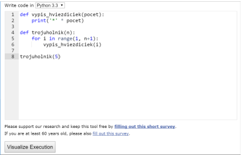
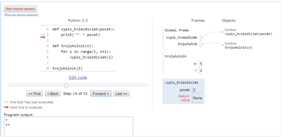
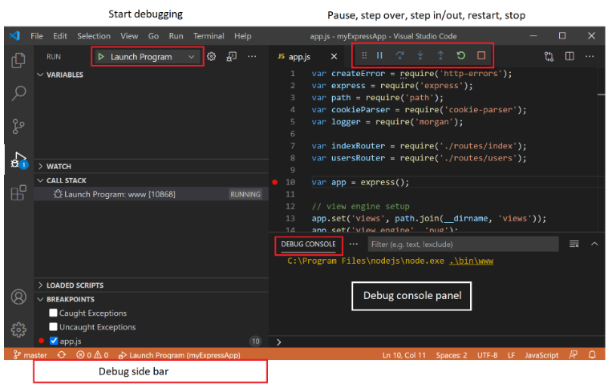
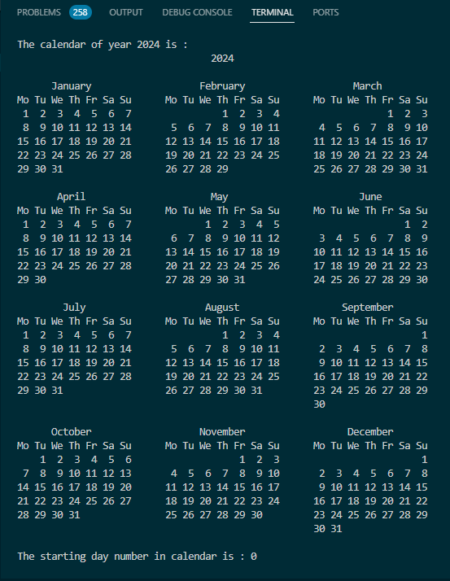
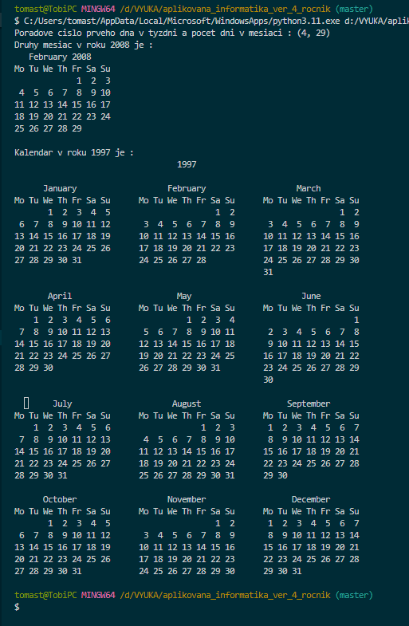

>### Mechanizmus volania funkcie

si vysvetlíme na volaní vypis_hviezdiciek(30):

1. zapamätá sa návratová adresa volania
2. vytvorí sa **nová** premenná pocet (formálny parameter) a priradí sa do nej hodnota **skutočného parametra** 30
3. vykonajú sa všetky príkazy v definícii funkcie (telo funkcie)
4. zrušia sa všetky premenné, ktoré vznikli počas behu funkcie
5. riadenie sa vráti na miesto, kde bolo volanie funkcie

Už vieme, že priraďovací príkaz vytvára premennú a referenciou ju spojí s nejakou hodnotou. **Premenné, ktoré vzniknú počas behu funkcie**, sa stanú **lokálnymi premennými:** budú existovať len počas tohto behu a po skončení funkcie, sa automaticky zrušia. Aj parametre vznikajú pri štarte funkcie a zanikajú pri jej skončení: tieto premenné sú pre funkciu tiež lokálnymi premennými.

V nasledovnom príklade funkcie vypis_sucet() počítame a vypisujeme súčet čísel od 1 po zadané n:
~~~
def vypis_sucet(n):
    sucet = 1
    print(1, end=' ')
    for i in range(2, n + 1):
        sucet = sucet + i
        print('+', i, end=' ')
    print('=', sucet)
~~~
Pri volaní funkcie sa pre parameter n = 10 vypíše:
~~~
def vypis_sucet(n):
    sucet = 1
    print(1, end=' ')
    for i in range(2, n + 1):
        sucet = sucet + i
        print('+', i, end=' ')
    print('=', sucet)

vypis_sucet(10)

# Vysledok je :
# 1 + 2 + 3 + 4 + 5 + 6 + 7 + 8 + 9 + 10 = 55
~~~
Počas behu vzniknú 2 lokálne premenné a jeden parameter, ktorý je pre funkciu tiež lokálnou premennou:
* **n** vznikne pri štarte funkcie aj s hodnotou 10
* **sucet** vznikne pri prvom priradení sucet = 1
* **i** vznikne pri štarte for-cyklu

Po skončení behu funkcie sa všetky tieto lokálne premenné automaticky zrušia.

Pred chvíľkou sme sa dozvedeli že existujú lokálne premenné ktoré vznikajú a sú používané pri definovaní funkcii. Okrem týchto lokálných premenných rozlišujeme a štandardné a globálne premenné ktoré vystupujú v tzv. **menných priestoroch (namespace)**

Aby sme lepšie pochopili ako naozaj fungujú spomínané lokálne premenné, musíme najprv porozumieť tomu, čo to je a ako funguje menný priestor. Najprv však trochu ďalšej terminológie: všetky identifikátory v Pythone sú jedným z troch typov. **Identifikátory** sú názvy, ktoré dávame na identifikáciu premennej, funkcie, triedy, modulu alebo iného objektu. To znamená, že kedykoľvek chceme dať nejakej entite meno, tak to meno sa nazýva sa to identifikátor. Niekedy sú premenná a identifikátor nesprávne stotožňované, ale nie je to tak. Identifikátor aj premenná sú názvy, ktoré používatelia pridelili konkrétnej entite v programe . **Identifikátor sa používa iba na jedinečnú identifikáciu entity v programe v čase vykonávania**, zatiaľ čo **premenná je názov priradený pamäťovému miestu**, ktorý sa používa na uchovávanie hodnoty. (Python má pre identifikátory 3 rôzne tabuľky mien):

* **tabuľka štandardných mien resp. štandardné identifikátory**, napr. int, print, … Sú to mená ktoré **sú definované ako príkazy, funckie a pod. v programovacom jazyku. Nevýtvárame ich my.
    * hovoríme jej **builtins**
* **tabuľka globálných mien resp. globáln e identifikátory** - definujeme ich na najvyššej úrovni mimo našich funkcií, napr. funkcia vypis_sucet . Tieto mená my vytvárame.
    * hovoríme jej **main**
* **tabuľka lokálných mien resp. lokálne identifikátory** - ktoré vznikajú iba počas behu funkcie. Tieto mená my vytvárame.

Tabuľka štandardných mien je len jedna, jedna je tiež tabuľka globálnych mien, ale každá funkcia má svoju „súkromnú“ lokálnu tabuľku mien, ktorá vznikne pri štarte (zavolaní) funkcie a zruší sa pri konci vykonávania funkcie.

Keď na nejakom mieste použijeme identifikátor - trvalý identifikačný údaj ktorý udáva jednoznačnosť príslušného objektu (napr. rodné číslo u človeka), Python ho najprv hľadá (v tzv. **priestoroch mien**):

* v lokálnej tabuľke mien, ak tam tento identifikátor nenájde, hľadá ho
* * v globálnej tabuľke mien, ak tam tento identifikátor nenájde, hľadá ho
v štandardnej tabuľke mien

Ak nenájde v žiadnej z týchto tabuliek, hlási chybu NameError: name 'identifikátor' is not defined.

Príkaz **dir() ktorý je štandardnou funkciou  vypíše tabuľku globálnych mien**. Hoci pri štarte Pythonu by táto tabuľka mala byť prázdna, obsahuje niekoľko špeciálnych mien, ktoré začínajú aj končia znakmi '__':
~~~
>>> dir()
['__builtins__', '__doc__', '__loader__', '__name__', '__package__', '__spec__']
~~~
Keď teraz vytvoríme nejaké nové globálne mená, objavia sa aj v tejto globálnej tabuľke:
~~~
premenna = 2015
def funkcia():
    pass

print(dir())

# Vysledkom je :
# ['__builtins__', '__doc__', '__loader__', '__name__', '__package__', '__spec__',
#  'funkcia', 'premenna']
~~~
Podobne sa vieme dostať aj k **tabuľke štandardných mien** (builtins):
~~~
print(dir(__builtins__))
['ArithmeticError', 'AssertionError', 'AttributeError', ...]
~~~
S týmito tabuľkami súvisí aj príkaz del na zrušenie premennej.

>### Príkaz del

Príkazom del zrušíme identifikátor z tabuľky mien. 

Formát príkazu:

**del** premenná

Príkaz najprv zistí, v ktorej tabuľke sa identifikátor nachádza (najprv pozrie do tabuľky lokálných mien a keď ho tam nenájde, tak ide pozrieť do globálnej tabuľky) a potom ho z tejto tabuľky vyhodí. Príkaz nefunguje pre tabuľku štandardných mien t.j. mien ktoré sú dané a ktoré nevytvárame.

Ukážme to na príklade: identifikátora **print** ktorý je menom štandardnej funkcie (v štandardnej tabuľke mien). Ak v priamom režime (čo je globálna úroveň mien) do premennej print priradíme nejakú hodnotu, toto meno vznikne v globálnej tabuľke:
~~~
>>> print('ahoj')
ahoj

>>> print=('ahoj')   # do print sme priradili nejakú hodnotu

>>> print
'ahoj'

>>> print('ahoj')
...
TypeError: 'str' object is not callable
~~~
Teraz už print nefunguje ako funkcia na výpis hodnôt, ale len ako obyčajná globálna premenná. Ale v štandardnej tabuľke mien print stále existuje, len je **prekrytá** globálnym menom. Python predsa najprv prehľadáva globálnu tabuľku a až keď sa tam nenájde, hľadá sa v štandardnej tabuľke. A ako môžeme napr vrátiť funkčnosť štandardnej funkcie print ? Stačí iba vymazať identifikátor z globálnej tabuľky a zase dostaneme funkciu:
~~~
>>> del print
>>> print('ahoj')
ahoj
~~~
**Vymazaním globálneho mena ktoré bolo pôvodne standardné meno funkcie (napr. print) zruší sa prekrytie a zostane toto meno definované len ako identifikátor v tabuľke štandardných mien**, a teda opäť začne fungovať funkcia na výpis hodnôt.

Pozrime sa teraz na prípad, keď sa v tele funkcie bude nachádzať volanie inej funkcie (tzv. **vnorené volanie**), napr.
~~~
def vypis_hviezdiciek(pocet):
    print('*' * pocet)

def trojuholnik(n):
    for i in range(1, n + 1):
        vypis_hviezdiciek(i)
~~~
Pri ich definovaní vznikli v tabuľke globálných mien dva identifikátory: **vypis_hviezdiciek a trojuholnik**. Zavoláme funkciu trojuholnik:
~~~
def vypis_hviezdiciek(pocet):
    print('*' * pocet)

def trojuholnik(n):
    for i in range(1, n + 1):
        vypis_hviezdiciek(i)

trojuholnik(5)
~~~
Najprv sa pre túto funkciu vytvorí jej **priestor mien** (lokálna tabuľka mien) s dvomi lokálnymi premennými: **n** a **i**. Teraz **pri každom** (vnorenom) volaní vypis_hviezdiciek(i) sa pre túto funkciu:

* vytvorí nový priestor mien s jedinou premennou **pocet**
* vykoná sa príkaz print()
* nakoniec sa zruší jej priestor mien, t.j. zanikne premenná pocet

Môžeme si to pre názornosť odkrokovať pomocou [interaktívneho Pythonu]( http://www.pythontutor.com/visualize.html#mode=edit ) (zapneme voľbu Python 3.3):

* najprv do editovacieho okna zapíšeme nejaký program, napr.

* spustíme vizualizáciu pomocou tlačidla Visualize Execution a potom niekoľkokrát tlačíme tlačidlo Forward 

Všimnite si, že v pravej časti tejto stránky sa postupne zobrazujú priestory mien (ktoré sa tu nazývajú frame):
* najprv len priestor (tabuľka) globálnych mien s premennými vypis_hviezdiciek a trojuholnik
* potom sa postupne objavujú a aj miznú priestory lokálne týchto dvoch funkcií - na obrázku vidíme oba tieto priestory mien tesne pred ukončením vykonávania funkcie trojuholnik s parametrom 2

>### Funkcia dir() a help()

Vrátime sa ešte raz k vyššie spomenutej vstavanej (build-in) funkcii [**dir()**](https://www.w3schools.com/python/gloss_python_module_dir.asp). Je to to totiž veľmi užitočná funkcia ktorá nám dáva zoznam všetkých názvov a premenných v module. Spolu s funkciou [**help()**](https://www.geeksforgeeks.org/help-function-in-python/) nám vie pomôct  rýchlo sa zorientovať ešte pred tým ako použijeme google alebo ChatGPT. 
~~~
import datetime
from datetime import timedelta
x = dir(datetime)
print('\nVypis dir modulu datetime\n\n', x)
# z = help(datetime)

y = dir(timedelta)
print('\nVypis dir modulu timedelta\n\n', y)
k = help(timedelta)
~~~

>## Rozdelenie funkcii

>### Funkcie s návratovou hodnotou

Väčšina štandardných funkcií v Pythone na základe svojich parametrov vráti nejakú hodnotu, napr.
~~~
>>> abs(-5.5)
5.5
>>> round(2.36, 1)
2.4
~~~
Funkcie, ktoré sme zatiaľ vytvárali my, takú možnosť nemali: iba niečo počítali, niečo vypisovali, ale žiadnu návratovú hodnotu nevytvárali. **Aby funkcia mohla vrátiť nejakú hodnotu ako výsledok volania funkcie**, musí sa v jej tele objaviť príkaz **return**, napr.
~~~
def meno(parametre):
    prikaz
    prikaz
    ...
    return hodnota                  # takáto funkcia bude vracať výslednú hodnotu
~~~
Príkazom return sa ukončí výpočet funkcie (zruší sa jej priestor mien) a uvedená hodnota sa stáva výsledkom funkcie, napr.
~~~
def eura_na_koruny(eura):
    koruny = round(eura * 30.126, 2)
    return koruny
~~~
môžeme otestovať:
~~~
def eura_na_koruny(eura):
    koruny = round(eura * 30.126, 2)
    return koruny

print('dostal si', 123, 'euro, čo je', eura_na_koruny(123), 'korún')

# Vysledkom je :
# dostal si 123 euro, čo je 3705.5 korún
~~~
Niekedy potrebujeme návratovú hodnotu vypočítať pomocou nejakého cyklu, napr. nasledovná funkcia počíta súčet čísel od 1 do n:
~~~
def suma(n):
    vysledok = 0
    while n > 0:
        vysledok += n
        n -= 1
    return vysledok
~~~
Zároveň vidíme, že akýsi nový tzv. **formálny parameter* (ktorý je lokálnou premennou) môžeme v tele funkcie modifikovať.

Už sme videli, že rozlišujeme dva typy funkcií:

* také, ktoré **iba niečo robia** (napr. vypisujú, kreslia, …), ale nevracajú návratovú hodnotu ( **neobsahujú return** s nejakou hodnotou )
* také, ktoré **niečo vypočítajú a vrátia** nejakú výslednú hodnotu - musia **obsahovať return** s návratovou hodnotou

Ďalej ukážeme, že rôzne funkcie môžu vracať hodnoty rôznych typov. Najprv číselné funkcie.

>### Číselné funkcie 
Výsledkom takejto funkcie je číslo. Nasledovná funkcia počíta n-tú mocninu nejakého čísla a tento výsledok ešte zníži o 1:
~~~
def pocitaj(n):
    return 2 ** n - 1
~~~
Zrejme výsledkom tejto funkcie je vždy len číslo.

V pythone je možné ľahko alebo množstvo matematických operácií riešiť importovaním modulu s názvom **math**, ktorý definuje rôzne funkcie na uľahčenie výpočtov v našich úlohách. Použitie niektorých z nich najdeme [tu](https://www-geeksforgeeks-org.translate.goog/mathematical-functions-python-set-1-numeric-functions/?_x_tr_sl=en&_x_tr_tl=sk&_x_tr_hl=sk&_x_tr_pto=wapp). **Trigonometrické funkcie** zase nájdeme [tu](https://www-geeksforgeeks-org.translate.goog/mathematical-functions-in-python-set-3-trigonometric-and-angular-functions/?_x_tr_sl=en&_x_tr_tl=sk&_x_tr_hl=sk&_x_tr_pto=wapp) a s používaním **logaritmických funkcii** sa môžeme zoznámiť [tu](https://www-geeksforgeeks-org.translate.goog/mathematical-functions-python-set-2-logarithmic-power-functions/?_x_tr_sl=en&_x_tr_tl=sk&_x_tr_hl=sk&_x_tr_pto=wapp). Poslednou skupinu ktorá patrí do skupiny numerických funkcii a ktorú na tomto mieste spomenieme sú **špecialne funkcie a konštatnty**. Ich popis s príkladmi nájdeme [tu](https://www-geeksforgeeks-org.translate.goog/mathematical-functions-in-python-set-4-special-functions-and-constants/?_x_tr_sl=en&_x_tr_tl=sk&_x_tr_hl=sk&_x_tr_pto=wapp).

>### Logická funkcia

Funkcie môžu vracať aj hodnoty iných typov, napr.
~~~
def parne(n):
    return n % 2 == 0
~~~
Táto funkcia vráti True alebo False podľa toho či je n párne (zvyšok po delení 2 bol 0), vtedy vráti True, alebo nepárne (zvyšok po delení 2 nebol 0) a vráti False. Túto istú funkciu môžeme zapísať aj tak, aby bolo lepšie vidieť tieto dve rôzne návratové hodnoty:
~~~
def parne(n):
    if n % 2 == 0:
        return True
    else:
        return False
~~~
Hoci táto verzia robí presne to isté ako predchádzajúca, skúsení programátori radšej používajú kratšiu prvú verziu. Keď chceme túto funkciu otestovať, môžeme zapísať:
~~~
def parne(n):
    if n % 2 == 0:
        return print(True)     # pre hodnotu 10
    else:
        return print(False)    # pre hodnotu 11

parne(10)

# Vysledkom je :
# True

parne(11)

# Vysledkom je :
# False
~~~

~~~
def parne(n):
    if n % 2 == 0:
        return print(True)     # pre parne
    else:
        return print(False)    # pre neparne

for i in range(20, 30):
    print(i, parne(i))

# Vysledok je :
# 20 True
# 21 False
# 22 True
# 23 False
# 24 True
# 25 False
# 26 True
# 27 False
# 28 True
# 29 False
~~~

>### Reťazcové funkcie

Napíšme funkciu, ktorá vráti nejaký reťazec v závislosti od hodnoty parametra:
~~~
def farba(ix):
    if ix == 0:
        return 'red'
    elif ix == 1:
        return 'blue'
    else:
        return 'yellow'
~~~
Funkcia vráti buď červenú, modrú, alebo žltú farbu v závislosti od hodnoty parametra.

Opäť by ju bolo dobre najprv otestovať, napr.
~~~
def farba(ix):
    if ix == 0:
        return 'red'
    elif ix == 1:
        return 'blue'
    else:
        return 'yellow'

for i in range(6):
    print(i, farba(i))

# Vysledok je :
# 0 red
# 1 blue
# 2 yellow
# 3 yellow
# 4 yellow
# 5 yellow
~~~
Uvedomme si, prečo ju môžeme zapísať aj takto bez else vetiev:
~~~
def farba(ix):
    if ix == 0:
        return 'red'
    if ix == 1:
        return 'blue'
    return 'yellow'
~~~

V takýchto prípadoch je na vás, ktorý zápis použijete, a ktorý z nich sa vám zdá čitateľnejší.

>### Grafické funkcie

Poslednou skupinou základného rozdelenia funkcii ktorým budeme venovať samostatnú kapitolu sú grafické funkcie. Ide o funkcie pre ktoré je charakteristický grafický výstup t.j. nejaký obrázok resp. graf.

>### Funkcia ako hodnota

v Pythone sú aj funkcie objektami a môžeme ich priradiť do premennej, napr.
~~~
def fun1(x):
    return x*x

fun1(7)
print(fun1(7))

# Vysledok je :
# 49

cojaviem = fun1
print(cojaviem(8))

# Vysledok je :
# 64
~~~

Funkcie môžu byť prvkami polí, napr.
~~~
def fun1(x):
    return x*x
def fun2(x): return 2*x+1
def fun3(x): return x//2

pole = [fun1, fun2, fun3]

for f in pole:
    print(f(10))

# Vysledok je :
# 100
# 21
# 5
~~~

Funkciu môžeme poslať ako parameter do inej funkcie, napr.
~~~
def urob(fun, x):
    return fun(x)

def fun2(x): return 2*x+1

urob(fun2, 3.14)
print(urob(fun2, 3.14))

vysledok=urob(fun2, 3.14)
print(vysledok)
# Vysledok je :
# 7.28
~~~

Funkcia (teda referencia na funkciu) môže byť aj prvkom asociatívneho poľa (indexy sú textové reťazce a nie čísla). Ilustruje to príklad s tzv.[korytnačkou](chrome-extension://efaidnbmnnnibpcajpcglclefindmkaj/https://zona.fmph.uniba.sk/fileadmin/fmfi/sluzby/elektronicke_studijne_materialy/Python1.pdf) ktora sa používa pri kreslení útvarov v oblasti grafiky:
~~~
import turtle

def vykonaj():
    t = turtle.Turtle()     # vytvorenie grafickej plochy
    p = {'fd': t.fd, 'rt': t.rt, 'lt': t.lt} # asociativne pole s klucami
    while True:
        prikaz, parameter = input('> ').split()
        p[prikaz](int(parameter))
~~~
Na spustenie treba tento kod ulozit ako skript napr. do suboru korytnacka.py v adresesári ktorý máte nastavený v Git Bash. Keď sa vytvorí kresliace okno , tak do terminálového okna za šípku treba zadavat jednotlivé kombinácie hodnôt (smer počet_bodov) kam sa má posunúť koryrnačka (šípka):
~~~
import turtle   # import grafickeho modulu

def vykonaj():
    t = turtle.Turtle()  # vytvorenie grafickej plochy
    p = {'fd': t.fd, 'rt': t.rt, 'lt': t.lt} # pozicia sipky
    while True:
        prikaz, parameter = input('> ').split() # vstup smeru pohybu a hodnot o kolko napr. fd o 100 
        p[prikaz](int(parameter))

vykonaj()   # volanie funkcie bez parametrov

# Priklad vstupnych dvojic hodnot:
# > fd 100  kde fd je skrateny zapis posunu forward
# > lt 90   kde lt je skrateny zapis natocenia uhlu left
# > fd 50   
# > rt 60   kde fd je skrateny zapis natocenia uhlu right
# > fd 100  
~~~
Bola tu tiež použitá funkcia [split(https://www.w3schools.com/python/ref_string_split.asp)]() ktorá rozdeluje reťazec do zoznamu. Každé slovo tu predstavuje položku zoznamu. Pre názornosť uveďme príklad:
~~~
txt = "welcome to the jungle"

x = txt.split()

print(x)

# Vysledkom je :
# ['welcome', 'to', 'the', 'jungle']
~~~
>### Anonymné funkcie

Často sa namiesto jednoriadkovej funkcie, ktorá počíta jednoduchý výraz a tento vráti ako výsledok (return) používa špeciálna konštrukcia **lambda**. Tá **vygeneruje tzv. **anonymnú funkciu**, ktorú môžeme priradiť do premennej alebo poslať ako parameter do funkcie.

 Mechanizmus funguje nasledovne: Ak chceme získat hodnotu ktorú nám vytvorí anonymná funkcia (a) musíme jej poslať cez jej priradenie (x) vstupný údaj (8) ktorý prenesie do svojho vzťahu (a+3.14)kde nahradí touto hodnotou premennú (a) aby po výpočte funkcie opäť cez priradenie (x) vrátila výsledok anonymnej funkcie (x sa zmení z hodnoty 8 na 11.14) 

Príklad a zápis názvu priradenia (x), názvu anonymnej funkcie (a) s premennou (a) môže vyzerať napr. takto:
~~~
x = lambda a : a + 3.14
print(x(8))

# Vysledok je :
# 11.14 
~~~
Obdobne to platí aj pri použití lambdy vo funkcii :
~~~
def myfunc(n):
#    x= lambda a : a + 3.14
#    return x
    return lambda a : a + n

vysledok = myfunc(2.14)
print(vysledok(1))

# Vysledok je :
# 3.14
~~~
V tomto prípade mechanizmus použitia anonymnej funkcie priradí miesti n do regulernej funkcie hodnotu 2.14 a do anonymnej funkci cez priradenie x hodnotu 1.

Tvar konštrukcie lambda je nasledovný:

>               lambda parametre : výraz

Tento zápis nahrádza definovanie funkcie:
~~~
def anonymne_meno(parametre):
    return vyraz
~~~

Môžeme zapísať napr.
~~~
lambda x: x%2==0              # funkcia vráti True pre párne číslo
lambda x,y: x**y              # vypočíta príslušnú mocnimu čísla
lambda x: isinstance(x, int)  # vráti True pre celé číslo
~~~

>### Mapovacie funkcie

Použitie funkcie ako parametr funkcie najlepšie ilustruje funkcia mapuj():
~~~
def mapuj(fun, pole):
    vysl = []
    for prvok in pole:
        vysl.append(fun(prvok))
    return vysl
~~~

**Mapovacia funkcia aplikuje danú funkciu (prvý parameter) na všetky prvky poľa a z výsledkov poskladá nové pole**, napr.
~~~
def mapuj(fun, pole):
    vysl = []
    for prvok in pole:
        vysl.append(fun(prvok))
    print(vysl)
    return vysl

# treba nadefinovat co ma aplikovat fun1 na pole (2,3,7)
# z tuple (2,3,7) vytvorit zoznamu [4, 9, 49] (pozor na iteratelnost !)

def fun1(x):       # najprv sa urobi volanie fun1 kde sa definuje fun1
    return x ** 2

mapuj(fun1, (2,3,7))   # a potom sa s tym zavola funkcia mapuj

# Vysledok je :
# [4, 9, 49]

mapuj(list,'Python')

# Vysledok je :
# [['P'], ['y'], ['t'], ['h'], ['o'], ['n']]

mapuj(lambda x: [x]*x, range(1,6))

# Vysledok je :
# [[1], [2, 2], [3, 3, 3], [4, 4, 4, 4], [5, 5, 5, 5, 5]]
~~~

V Pythone existuje však aj štandardná funkcia [**map()**](https://www.w3schools.com/python/ref_func_map.asp), ktorá vykoná špecifickú funkciu pre každú položku v iterovateľnom kroku. Položka sa odošle do funkcie ako parameter. 

Je to niečo podobné ako naša funkcia mapuj() ale s tým rozdielom, že **map() nevracia pole**, ale niečo ako **vygenerovaný objekt**, ktorý môžeme použiť vo for-cykle tak že postupne prechádzame, alebo ho napr. môžeme previesť na pole za pomoci funkcie list():
~~~
>>> list(map(int,str(2**30)))
[1, 0, 7, 3, 7, 4, 1, 8, 2, 4]
~~~
Vráti pole cifier čísla 2**30.

Podobná funkcii mapuj() je aj funkcia filtruj(), ktorá z daného poľa vyrobí nové pole, ale nechá len tie prvky, ktoré spĺňanú nejakú podmienku. Podmienka je definovaná funkciou, ktorá je prvým parametrom:
~~~
def filtruj(fun, pole):
    vysl = []
    for prvok in pole:
        if fun(prvok):
            vysl.append(prvok)
    return vysl
~~~
Cely kód bude :
~~~
def filtruj(fun, pole):
    vysl = []
    for prvok in pole:
        if fun(prvok):
            vysl.append(prvok)
    print(vysl)
    return vysl

def podm(x): 
    return x%2==0   # zistí, či je číslo párne

def mapuj(fun, pole):
    vysl = []
    for prvok in pole:
        vysl.append(fun(prvok))
    print(vysl)
    return vysl

pocet_cisiel=list(range(1, 20, 3))
print(pocet_cisiel)
# Pocet skumanych cisiel je :
# [1, 4, 7, 10, 13, 16, 19]

mapuj(podm, range(1, 20, 3))
# Vysledok je :
# [False, True, False, True, False, True, False]

filtruj(podm, range(1, 20, 3))
# Vysledok je :
# [4, 10, 16]
~~~

Podobne ako pre mapuj() existuje štandardná funkcia **map()**, aj pre filtruj() existuje štandardná funkcia **filter()** - tieto dve funkcie ale **nevracajú pole (list) ale postupnosť**, ktorá sa dá prechádzať for-cyklom alebo poslať ako parameter do funkcie, kde sa očakáva postupnosť.

Ukážkovým využitím funkcie map() je funkcia, ktorá počíta ciferný súčet nejakého čísla:
~~~
def cs(cislo):
    return sum(map(int,str(cislo)))

cs(1234)
print(cs(1234))

# Vysledok je :
# 10
~~~

>### Čiastkové funkcie

**Čiastkové funkcie** nám **umožňujú opraviť určitý počet argumentov funkcie a vygenerovať novú funkciu**. Čiastočné funkcie možno použiť na odvodenie špecializovaných funkcií zo všeobecných funkcií, a preto nám pomáhajú znova použiť náš kód.
~~~
from functools import partial
           
# Pôvodná funkcia je :                  
def f(a, b, c, x):
    return 1000*a + 100*b + 10*c + x
                   

# Cistkova funkcia ktora vola funkciu f
# ma preddefinovane hodnoty a=3, b=1 a c=4. Chyba
# iba x ktore je prenesene cez ciastkovu funkciu s 
# hodnotou 5 ktora po dosadeni do povodnej funkcie
# da vysledok. To co chyba sa dosadza !
                   
g = partial(f, 3, 1, 4)
                   
# Volanie g()
print(g(5))
                   
# Vysledok je :
# 3145
~~~
V príklade sme našu funkciu vopred vyplnili niektorým konštantnými hodnotami a, b a c. A g() má iba jeden argument, t.j. premennú x ktorá bola dosadená.

Ďalší príklad:
~~~
from functools import *
                   
# Normalna funkcia
def add(a, b, c):
    return 100 * a + 10 * b + c
                   
# Ciastkova funkci a s b = 1 a c = 2
add_part = partial(add, c = 2, b = 1)
                   
# Volanie ciastkovej funcie
print(add_part(3))
                   
# Vysledok je :
# 312
~~~

>### Generátorová notácia

Veľmi podobná funkcii map() je generátorová notácia (po anglicky list comprehension):
* je to spôsob, ako môžeme elegantne vygenerovať nejaké pole pomocou for-cyklu a nejakého výrazu
  
* do [...] nezapíšeme prvky poľa, ale predpis, akým sa majú vytvoriť, základný tvar je tohto zápisu:

                vyraz for i in postupnosť

* kde výraz najčastejšie obsahuje premennú cyklu a postupnosť je ľubovoľná štruktúra, ktorá sa dá prechádzať for-cyklom (napr. list, set, str, range(), riadky otvoreného súboru, ale aj výsledok map() a filter() a pod.
  
* táto notácia môže používať aj vnorené cykly ale aj podmienku if, vtedy je to v takomto tvare:

            for i in postupnosť if podmienka
* generátorová notácia s podmienkou nechá vo výsledku len tie prvky, ktoré spĺňajú danú podmienku

Niekoľko príkladov:
~~~
>>> [i**2 for i in range(1, 11)]
[1, 4, 9, 16, 25, 36, 49, 64, 81, 100]

>>> [[i*j for i in range(1, 6)] for j in range(1, 6)]
[[1, 2, 3, 4, 5], [2, 4, 6, 8, 10], [3, 6, 9, 12, 15], [4, 8, 12, 16, 20], [5, 10, 15, 20, 25]]

>>> [i for i in range(100) if cs(i)==5]      # cs() vypočíta ciferný súčet
[5, 14, 23, 32, 41, 50]
~~~
Pomocou tejto konštrukcie by sme vedeli zapísať aj mapovacie funkcie vo vyššie uvedených príkladoch :
~~~
def mapuj(fun, pole):
    return [fun(prvok) for prvok in pole]

def filtruj(fun, pole):
    return [prvok for prvok in pole if fun(prvok)]
~~~
Všimnite si, že funkcia filtruj() využíva if, ktorý je vo vnútri generátorovej notácie.

Tabuľka všetkých zabudovaných funkcii je tu :
https://docs.python.org/3/library/functions.html

>### Testovanie funkcie

Ak chceme **funkciu otestovať**, buď ju **spustíme s konkrétnym parametrom**, alebo **napíšeme cyklus**, ktorý našu funkciu spustí s **konkrétnymi hodnotami** (niekedy na testovanie vytvoríme ďalšiu testovaciu funkciu, ktorá nerobí nič iné, „len“ testuje funkciu pre rôzne hodnoty a porovnáva ich s očakávanými výsledkami). Možnosťou je použiť aj vizualizáciu vykonávania výpočtu https://pythontutor.com/render.html#mode=edit.

Príklad kedy voláme 2x funkciu pocitaj. Prvý krát s parametrom 5 a druhý krát v tele cyklu for pri použití funkcie [format()](https://www.w3schools.com/python/ref_string_format.asp) na string. 
V prvom prípade chcemy aby nám funkcia vracala hodnotu 31 a v druhom prípade tá istá funcia pre jednotlivé vstupy hodnôt (1, 2, 3, 8, 10, 16, 20, 32) vracala požadované výstupy hodnôt (1, 3, 7, 255, 1023, 65 535, 1 048 575 a 4 249 667 295 )
Ak vo VS-Code spustíme tento kód dostaneme hlasenie prvej chyby " chýba definícia funkcie pocitaj() ktorá by mala vracať požadované hodnoty.
~~~
# pre :
pocitaj(5)
# Chceme ziskat takyto vystup: 31

# a pre cyklus :
for i in 1, 2, 3, 8, 10, 16, 20, 32:
    print('pocitaj( {} ) = {}'.format(i, pocitaj(i)))

# Chceme ziskat taketo vysledky:
# pocitaj( 1 ) = 1
# pocitaj( 2 ) = 3
# pocitaj( 3 ) = 7
# pocitaj( 8 ) = 255
# pocitaj( 10 ) = 1023
# pocitaj( 16 ) = 65535
# pocitaj( 20 ) = 1048575
# pocitaj( 32 ) = 4294967295
~~~
Dobre doplníme do kódu definíciu funkcie pocitaj():
~~~
def pocitaj(n):
    print(n)
    x=n
    return x

# pre :
pocitaj(5)
# Chceme ziskat takyto vystup: 31

# a pre cyklus :
for i in 1, 2, 3, 8, 10, 16, 20, 32:
    print('pocitaj( {} ) = {}'.format(i, pocitaj(i)))
~~~
Po jej spustení však nedostávame požadované hodnoty. To znamená že výpočet vystupnej hodnoty premennej x vo funkcii pocitaj() nie je dobrý. Aká má byť teda funkcia pre premennú x aby sme dostali požadované výsledky ? Keď sme zbehlí matematici tak tú funkciu vidíme, druhá možnosť je použiť metódu pokus-omyl a postupne meniť podľa vysledkov konštrukciu rovnice x=f(n). Treťou možnosťou je použiť umelú inteligenciu (**A**rtifical **I**nteligence) a prostredníctvom [ChatGPT](https://chat.openai.com/c/3cc97c65-045e-4df4-a750-57a422b63fa0) ju požiadať o pomoc. Predtým sa však na **OpenAI** musíte [zaregistrovať](https://chat.openai.com/auth/login). Výsledok sa dostaví:
~~~
# Define the function pocitaj
def pocitaj(n):
    return (2**n)-1 # Use the formula for generating the required sequence
 

# Test the function with the given values
print(pocitaj(5))

# Iterate through the specified values and print the results
for i in 1, 2, 3, 8, 10, 16, 20, 32:
    print('pocitaj( {} ) = {}'.format(i, pocitaj(i)))
~~~
AI poúkne aj inú, trochu komplikovanejšiu [verziu](https://chat.openai.com/c/459d8ed6-032c-4e26-8ab6-ea761c82e9fb):  

Ďalšia funkcia zisťuje dĺžku (počet znakov) zadaného reťazca. Využíva to, že for-cyklus vie prejsť všetky znaky reťazca a s každým môže niečo urobiť, napr. zvýšiť počítadlo o 1:
~~~
def dlzka(retazec):
    pocet = 0
    for znak in retazec:
        pocet += 1
    return pocet
~~~
Otestujeme:
~~~
>>> dlzka('Python')
6
>>> dlzka(10000 * 'ab')
20000
~~~
Ďalším spôsobom je testovanie pomocou [Debugger-a](https://code.visualstudio.com/docs/editor/debugging) ktorý je integrovaný vo VS-Code.

Touto problematikou sa na tomto mieste zaoberať nebudeme a pre predstavu toho čo obsahuje testovanie a ladenie kódu v Pythone pomocou debuggera nám zatiaľ postačí nasledovné [video](https://www.youtube.com/watch?v=b4p-SBjHh280).

## Rekurzívne funkcie 

Pri riešení nášho predchádzajúceho príkladu nám ChatGPT ponúkol aj druhú verziu kedy bola funkcia pocitaj() definovaná ako [**rekurzívna funkcia**](https://www.w3schools.com/python/gloss_python_function_recursion.asp). Počíta ta tu špecifickú sekvenciu a je dôležité, aby sme sa uistili, že funkcia je definovaná a dostupná skôr, ako sa ju pokúsite zavolať. V tomto upravenom kóde pocitaj() je funkcia definovaná so základným prípadom pre n == 1 a rekurzívnym prípadom pre ostatné hodnoty n. Keď n nie je 1, funkcia vráti hodnotu 2 * pocitaj(n-1) + 1, ktorá pomáha pri výpočte požadovanej sekvencie. Cyklus for bol upravený tak, aby používal na iteráciu hodnôt **zoznam** čísel [1, 2, 3,...] namiesto **n-tice** (1, 2, 3,...).
Python tiež akceptuje **rekurziu funkcie**, čo znamená, že definovaná funkcia môže **volať sama seba**. Programátor by však mal byť veľmi opatrný pri rekurzii, pretože môže byť celkom ľahké skĺznuť do písania funkcie, ktorá sa nikdy nekončí, alebo funkcie, ktorá využíva nadmerné množstvo pamäte alebo výkonu procesora. Ak je však rekurzia napísaná správne, môže byť veľmi efektívnym a  elegantným prístupom k programovaniu.
~~~
# Define the function pocitaj
def pocitaj(n):
    if n == 1:
        return 1
    else:
        return 2 * pocitaj(n-1) + 1

# Now you can call the function
# pre :
print(pocitaj(5)) # line 2

# a pre cyklus :
for i in [1, 2, 3, 8, 10, 16, 20, 32]:
    print('pocitaj( {} ) = {}'.format(i, pocitaj(i)))
~~~
Pre úplnosť uvedne ešte jeden názorný príklad:
~~~
def tri_recursion(k):
  if(k>0):
    result = k+tri_recursion(k-1)
    print(result)
  else:
    result = 0
  return result

print("\n\nRecursion Example Results")
tri_recursion(6)
~~~
A pozrime si ho vo [vyzualizáci výpočtu](https://pythontutor.com/render.html#mode=display) kde vidíme že funkcia tri_rekursion ktorá sa používa aj v tele bola súčasne vyriešená a dala inú hodnotu.

## Časové funkcie

Python definoval **modul „time“**, ktorý nám umožňuje vykonávať rôzne **operácie týkajúce sa času**, jeho konverzie a reprezentácie, ktoré nachádzajú svoje využitie v rôznych aplikáciách. Začiatok času sa začal merať od **1. januára, 00:00, 1970** a práve tento čas sa v Pythone označuje ako **„ epocha“**.

>### Operácie s časom v Pythone

Operácie s časom, dátumom a kalendárom sú zahrnuté v module datetime ktorého dokumentáciu spolu s dokumentáciou aj iných modulov nájdeme [**tu**](https://docs.python.org/3/library/datetime.html#module-datetime).

### Funkcia time.time()

Pythonovská funkcia **time()** sa používa na **počítanie počtu sekúnd**, ktoré uplynuli od začiatku epochy. 
~~~
# Python code to demonstrate the working of
# time()

# importing "time" module for time operations
import time

# using time() to display time since epoch
print ("Seconds elapsed since the epoch are : ",end="")
print (time.time())
~~~
Viac o tejto funkcii nájdeme [tu](https://www.geeksforgeeks.org/python-time-time-method/)

### Funkcia time.gmtime().

Funkcia Pythonu **gmtime()** vracia štruktúru s 9 hodnotami, z ktorých každá predstavuje časový atribút v poradí. **Mení sekundy na časové atribúty (dni, roky, mesiace atď.)** do špecifikovaných sekúnd **od epochy**. Ak nie sú uvedené žiadne sekundy, čas sa počíta do súčasnosti. Tabuľka atribútov štruktúry je uvedená nižšie. 
~~~
Hodnoty atribútov indexu
 0 tm_rok 2008
 1 tm_mon 1 až 12
 2 tm_mday 1 až 31
 3 tm_hour 0 až 23
 4 tm_min 0 až 59
 5 tm_sec 0 až 61 (60 alebo 61 sú prestupné sekundy)
 6 tm_wday 0 až 6
 7 tm_yday 1 až 366
 8 tm_isdst -1, 0, 1, kde -1 znamená, že knižnica určuje DST
~~~
~~~
# Python code to demonstrate the working of gmtime()

import time

# using gmtime() to return the time attribute structure
print ("Time calculated acc. to given seconds is : ")
print (time.gmtime())

# Vysledok je :
# Time calculated acc. to given seconds is : 
# time.struct_time(tm_year=2016, tm_mon=8, tm_mday=2,
# tm_hour=7, tm_min=12, tm_sec=31, tm_wday=1, 
# tm_yday=215, tm_isdst=0)
~~~

### Funcie time.asctime() a time.ctime()

Funkcia Pythonu **time.asctime()** berie časovo priradený reťazec vytvorený gmtime() a vracia 24-znakový reťazec označujúci čas . Funkcia Pythonu time.ctime() **vracia 24-znakový časový reťazec** , ale ako argument berie sekundy a počíta čas do uvedených sekúnd . Ak neprejde žiadny argument, čas sa počíta do súčasnosti.
~~~
# Python code to demonstrate the working of
# asctime() and ctime()

# importing "time" module for time operations
import time
                      
# initializing time using gmtime()
ti = time.gmtime()
                      
# using asctime() to display time acc. to time mentioned
                      
print ("Time calculated using asctime() is : ",end="")
print (time.asctime(ti))
                      
# using ctime() to display time string using seconds
                      
print ("Time calculated using ctime() is : ", end="")
print (time.ctime())

# Vysledok je :
# Time calculated using asctime() is : Tue Aug  2  07:47:02 2016
# Time calculated using ctime() is : Tue Aug  2 07:47:02 2016
~~~

### Funkcia time.sleep()

Táto metóda sa používa na **zastavenie vykonávania programu na čas** špecifikovaný v argumentoch.
~~~
# Python code to demonstrate the working of
# sleep()
                      
# importing "time" module for time operations
import time
                      
# using ctime() to show present time
print ("Start Execution : ",end="")
print (time.ctime())
                      
# using sleep() to hault execution
time.sleep(4)
                      
# using ctime() to show present time
print ("Stop Execution : ",end="")
print (time.ctime())
                      
# Vysledok je :
# Start Execution : Tue Aug  2 07:59:03 2016
# Stop Execution : Tue Aug  2 07:59:07 2016
~~~

### Funkcia time.mktime()

V tomto príklade sme vytvorili objekt struct_time s n-ticou hodnôt pre každé z jeho polí, potom sme objekt odovzdali do **time.mktime()** , aby sme ho **skonvertovali na číslo s pohyblivou rádovou čiarkou** predstavujúce počet sekúnd epochy.
~~~
import time
                      
# Create a struct_time object representing a date and time
my_time = time.strptime("2023-05-10 14:30:00", "%Y-%m-%d %H:%M:%S")
                      
# Convert the struct_time object to a floating-point number 
seconds_since_epoch = time.mktime(my_time)
print("Seconds since epoch:", seconds_since_epoch)
                      
# Vysledok je :
# Seconds since epoch: 1683709200.0
                      
# Vysledok je :
# Seconds since epoch: 1683709200.0
~~~

### Funkcia time.localtime()

V tomto príklade voláme metódu (funkciu) [**time.localtime()**](https://www.geeksforgeeks.org/python-time-localtime-method/) bez argumentu, aby sme získali **aktuálny miestny čas ako struct_time**.
~~~
import time
                      
current_time = time.localtime()
                      
print(current_time)
                      
# Vysledok je :
# time.struct_time(tm_year=2023, tm_mon=5, tm_mday=10,
# tm_hour=12, tm_min=42, tm_sec=51, tm_wday=2, tm_yday=130, tm_isdst=0)
~~~

### Funkcia time.strftime()

Ako prvý argument berie formátovací reťazec, ktorý špecifikuje požadovaný formát výstupného reťazca.
~~~
import time
                      
now = time.localtime()
formatted_time = time.strftime("%Y-%m-%d %H:%M:%S", now)
print(formatted_time)
                      
# Vysledok je :
# 2023-05-10 13:42:04
~~~

### Funkcia timedelta()

A nakoniec spomedzi celej rady časových metód modulu [datetime](https://docs.python.org/3/library/datetime.html#module-datetime) spomeňme ešte metódu [**timedelta()**](https://www.geeksforgeeks.org/python-datetime-timedelta-function/) ktorá sa používa na **manipulácie s časom a dátumom** ako aj výpočet rozdielov medzi nimi. 

 Uveďme príklad pre funkciu z modulu datetime ktorý sme použili vyššie s funkciou timedelta na riešenie problému s ktorým sa stretávame velmi často. A to je zistiť rozdiel medzi dvomi časmi a vyjadriť to aj percenatmi:
~~~
from datetime import timedelta

hh1, mm1, ss1 = map(int, '15:53:45'.split(':'))
t1 = timedelta(hours=hh1, minutes=mm1, seconds=ss1)
print('Cas t1 je :\n',t1)
hh2, mm2, ss2 = map(int, '13:33:45'.split(':'))
t2 = timedelta(hours=hh2, minutes=mm2, seconds=ss2)
print('Cas t2 je :\n',t2)
rozdiel = t1-t2
print('Rozdiel casov t1-t2 je :\n', rozdiel)
percentage = t2/t1
print('Podiel casov t2/t1 je :\n', percentage)
~~~

>### Operácie s dátumom v Pythone 

Aj v Pythone je možná manipulácia s dátumom. Uskutočňuje sa to **pomocou modulu „datetime“ a použitím jeho triedy „date“**. Pritom je možné použiť aj dve konštanty MINYEAR a MAXYEAR.

###  Použitie konštanty MINYEAR pri dátume

MINYEAR zobrazuje minimálny rok , ktorý je možné poznať pomocou triedy dátumu.

###  Použitie konštanty MAXYEAR pri dátume
MAXYEAR zobrazuje prvý rok , ktorý môže byť vyjadrený pomocou triedy dátumu.
~~~
# Python code to demonstrate the working of
                   
# MINYEAR and MAXYEAR
                   
# importing built in module datetime
import datetime
                   
from datetime import date
                   
# using MINYEAR to print minimum representable year
print ("Minimum representable year is : ",end="")
print (datetime.MINYEAR)
                   
# using MAXYEAR to print maximum representable year
print ("Maximum representable year is : ",end="")
print (datetime.MAXYEAR)
                   
# Vysledok je :
# Minimum representable year is : 1
# Maximum representable year is : 9999
~~~

### Funkcia date(yyyy-mm-dd)

Táto funkcia vracia reťazec s odovzdanými argumentmi v poradí rok, mesiace a dátum.

### Funkcia today()

Vráti dátum súčasného dňa vo formáte rrrr-mm-dd.
~~~
# Python code to demonstrate the working of
# date() and today()
                   
# importing built in module datetime
import datetime # importovanie modulu datatime pre zadanie datumu               
from datetime import date   # importovanie triedy date pre sucasnny cas
                   
# pouzitie date() na zadaný dátum
print ("Zadany datum je : ",end="")
print (datetime.date(1997,4,1))
                   
# pouzitie today() na zobrazenie sucasneho datumu
print ("Sucasny datum je : ",end="")
print (date.today())
                   
# Vysledok je :
# Zadany datum je : 1997-04-01
# Sucasny datum je : : 2016-08-02
~~~

### Funkcia fromtimestamp(sec)
Vráti dátum vypočítaný z dvoch , ktoré uplynuli od epoch uvedených v argumentoch.

### Funkcia min()
Vráti minimálny dátum , ktorý môže byť reprezentovaný osvedčeným dátumom.

### Funkcia max()
Vráti prvý dátum , ktorý môže byť reprezentovaný osvedčeným dátumom.
~~~
# Python code to demonstrate the working of
# fromtimestamp(), min() and max()
                   
# importing built in module datetime
import datetime
from datetime import date
                   
# using fromtimestamp() to calculate date
print ("Vypocitany datum cez zadane sekundy od zaciatku epochy je : ",end="")
print (date.fromtimestamp(3452435))
                   
# using min() to print minimum representable date
print ("Minimalny reprezentujuci datum je : ",end="")
print (date.min)
                   
# using max() to print minimum representable date
print ("Maximalny reprezentujuci datum je : ",end="")
print (date.max)
                   
# Vysledok je :
# Vypocitany datum cez zadane sekundy od zaciatku epochy je : 1970-02-10
# Minimalny reprezentujuci datum je : 0001-01-01
# Maximalny reprezentujuci datum je : 9999-12-31
~~~

>### Operácie s kalendárom

### Funkcie calendar(), month(), isleap()…

Python má vstavaný **modul „ calendar “**, ktorý poskytuje funkcie a triedy na spracovanie **operácii súvisiacich s kalendárom**. Pomocou modulu [calendar](https://www.geeksforgeeks.org/python-calendar-module/) a jeho funkcii calendar(), month() a isleap() atď. ktoré sú definované nad triedou calendar.TextCalendar. Tá nám umôžňuje zobrazovať generovanie kalendárov s obyčajným textom. Označenie TextCalendar je v konkrétnom prípade nahradené funkciami ako calendar(), month(), firstweekday() a pod. Pre prípad mesiaca oktober (poradové čislo 11) roku 2023 potom môžeme použiť calendar.month() takto:
~~~ 
# import module
import calendar

yy = 2023
mm = 11

# display the calendar
print(calendar.month(yy, mm))
~~~

Operácie s kalendárom : 
1. **calendar(year, w, l, c, m )** - Táto funkcia zobrazuje rok, kde  w-šírka medzery medzi stĺpacami, l-pocet prazdných riadkov medzi tyždňami, c-medzera medzi dvomi mesiacmi a m-pocet stlpcov mesiacov. Standardne sú (w=2, l=1, c=6 a m=3). Podrobnejší popis týchto atribútov spolu s príkladmi a atribútov iných casových funkcii ktoré tu ešte spomenieme nájdeme [**tu**](https://www.w3resource.com/python/module/calendar/calendar.php)

2. **firstweekday()** - Táto funkcia vráti číslo dňa prvého týždňa . Štandardne 0 (napr. to má aj pondelok 1.1.2024).
~~~
# Kod pythonu na demonstrovanie prace s kalendarom
# calendar() a prvým dnom v tyzdni firstweeksday()
                     
# importovanie modulu kalendara pre vykonavanie 
# operaciis kalendarom
import calendar
                     
# pouzitie kalendara pre vytlacenie kalendara 
# daneho roku

# tlacenie kalendara pre rok 2024

print ("Kalendar pre rok 2024 je : ")
print (calendar.calendar(2024,2,1,6))    # mozno zadat iba rok lebo parametre maju defaultne hodnoty 
                     
# pouzitie prveho dna prveho tyzdna firstweekday()
# pre tlac zaciatku poradoveho cisla dna 0-je pondelok

print ("Poradove cislo prveho dna v prvom tyzdni roka je : ",end="")
print (calendar.firstweekday())
~~~                     

Vystup je : 

3. **isleap (year)** - Táto funkcia kontroluje, či je rok uvedený v argumente prestupný alebo nie .
4. **leapdays (year1, year2)** - Táto funkcia vráti počet prestupných dní medzi zadanými rokmi v argumentoch.
~~~
# Python code to demonstrate the working of
# isleap() and leapdays()
                     
# importing calendar module for calendar operations
import calendar
                     
# using isleap() to check if year is leap or not
                     
if (calendar.isleap(2008)):
    print ("The year is leap")

else : print ("The year is not leap")
                     
#using leapdays() to print leap days between years
print ("The leap days between 1950 and 2000 are : ",end="")
print (calendar.leapdays(1950, 2000))
                     
# Vysledok je :

# The year is leap
# The leap days between 1950 and 2000 are : 12
~~~

5. **month (year, month, w, l)** - Táto funkcia vytlačí mesiac konkrétneho roka uvedeného v argumentoch kde pre atribúty w a platí ako v 1./ (c-medzera medzi dvomi mesiacmi a m-pocet stlpcov mesiacov). Ostatné atribúbuty su jasné zo syntaxe funkcie.
~~~
# Kod Pythonu pre demonstrovanie prace s funkciou month()
                     
# importovanie modulu calendar pre operacie s kalendarom
import calendar
                     
# pouzitie funkcie month() pre zobrazenie mesiaca v danom roku
print ("Piaty mesiac v roku 2016 je :")
print (calendar.month(2016,5,2,1))
                     
# Vysledok je :

# Piaty mesiac v roku 2016 je:
#       máj 2016
# Po Ut St Št Pá So Ne
#                   1
#  2 3 4 5 6 7 8
#  9 10 11 12 13 14 15
# 16 17 18 19 20 21 22
# 23 24 25 26 27 28 29
# 30 31
~~~

### Ďalšie funkcie kalendára (monthrange(), prcal(), weekday()…

1. **monthrange(year, month)** - Metóda monthrange() sa používa na získanie dňa v týždni prvého dňa v mesiaci a počtu dní v mesiaci pre zadaný rok a mesiac. Táto funkcia vráti dve celé čísla, prvé, počiatočné číslo dňa v týždni (0 ako pondelok), druhé, počet dní v mesiaci .

2. **prcal(rok, w, l, c, m)** - Táto funkcia tiež vytlačí kalendár konkrétneho roka, ale nie je potrebná operácia „print“. Defaltné hodnoty atribútov sú (w=0, l=0, c=6, w=3)
~~~
# Kod Pythonu pre demonstrovanie pouzitia funkcii monthrange() a prcal()
                   
# importovanie modulu calendar pre operacie s kalendarom
import calendar
                   
# pouzitie funkcie monthrange() pre tlac pociatocneho dna v tyzdni a cisla mesiaca
print ("Poradove cislo prveho dna v tyzdni a pocet dni v mesiaci : ",end="")
print (calendar.monthrange(2008, 2))
print ("Druhy mesiac v roku 2008 je : ")
print (calendar.month(2008,2,2,1))

# pouzitie funkcie prcal() na tlac kalendara v roku 1997
print ("Kalendar v roku 1997 je : ")
calendar.prcal(1997,2,1,6)
~~~                   
Vysledok je :

3. **prmonth(year, month, w, l)** - Táto funkcia vytlačí aj mesiac konkrétneho roka , ale nie je potrebná operácia „print“. Pre atribúty w a l obdobne platí že w-šírka medzery medzi stĺpacami, l-pocet prazdných riadkov medzi tyždňami

4. **setfirstweekday(num)** - Táto funkcia nastavuje deň v týždniktorým sa má začať každý týždeň. (0 je pondelok, 6 je nedeľa). Hodnoty MONDAY, TUESDAY, WEDNESDAY, THURSDAY, FRIDAY, SATURDAY, and SUNDAY sú poskytnuté pre lepší prehľad. 

~~~
# Kod Python-u na demonstrovanie pouzitia funkcie prmonth() and setfirstweekday()
                   
# importovanie modulu calendar pre operacie s kalendarom
import calendar
                   
# pouzitie prmonth() na tlac kalendara roku 1997
print ("Stvrty mesiac roku 1997 je : ")
calendar.prmonth(1997, 4, 2, 1)
                   
# using setfirstweekday() to set first week day number
calendar.setfirstweekday(4)    # 4-ou je stanoveny piatku
print ("\r")
                   
# using firstweekday() to check the changed day
print ("Cislo prveho dna noveho tyzdna je : ",end="")
print (calendar.firstweekday())
                   
# Vysledok je :
# The 4th month of 1997 is : 
#      April 1997
# Mo Tu We Th Fr Sa Su
#     1  2  3  4  5  6
#  7  8  9 10 11 12 13
# 14 15 16 17 18 19 20
# 21 22 23 24 25 26 27
# 28 29 30
 
# Cislo prveho dna noveho tyzdna je : 4
~~~
~~~
# Nasledujúci kód nastavil prvý pracovný deň na nedeľu.
# importovanie modulu calendar pre operacie s kalendarom
import calendar
                   
# pouzitie prmonth() na tlac kalendara roku 1997
print ("Stvrty mesiac roku 1997 je : ")
calendar.prmonth(1997, 4, 2, 1)

# povodne oznacenie prveho dna v tyzdni 1-pondelok
print ("Poradove cislo prveho dna v tyzdni a pocet dni v mesiaci : ",end="")
print (calendar.monthrange(1997, 4))

# pouzitie setfirstweekday() na nastavenie noveho prveho dna v prvom tyzdni
calendar.setfirstweekday(calendar.SUNDAY) # miesto cisla 6 nazov dna SUNDAY
print ("\r")
                   
# pouzitie firstweekday() na kontrolu zmeny 1. dna
print ("Nove poradove cislo prveho dna v tyzdni je : ",end="")
print (calendar.firstweekday())
~~~

5. **weekday(year, month, date)** - Táto funkcia vráti poradové číslo dňa v týždni (0 je pondelok) ktorý je uvedený v jej argumentoch na pozícii date.
~~~
# Kod Python-u na demonstrovanie pouzitia funkcie weekday()
                   
# importovanie modulu calendar pre operacie s kalendarom
import calendar
                   
# pouzitie funkcie weekday() na zobrazenie poradoveho cisla datumu v danom tyzdni
print ("Poradove cislo dna 25.april.1977 je : ",end="")
print (calendar.weekday(1997,4,25))
                   
# Vysledok je :
# Poradove cislo dna 25.april.1977 je : 4
~~~
Video k tomu najdete na https://youtu.be/sZoW6hXxADM 

[SPÄŤ](../../Obsah.md)
