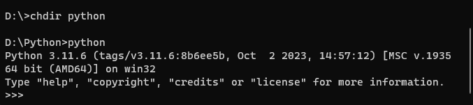

>## 1.	Vytvorenie pracovného prostredia

### Dôvody pre vytvorenie pracovného prostredia

* Pracovné prostredie je vytvárané pre potreby predmetov „Aplikovaná informatika“, „Spracovanie a vizualizácia dát“ a „Spracovanie dát na úrovni databázového servera“ na študijných odboroch „Digitálne služby v športe“ a „Spracovanie dát v športe“
*  Dôvodom je vytvorenie takých podmienok pre študentov, 
    *  aby bolo možné jednak napĺňať zásady uvedené v dokumente NASE_ZASADY.md,
    *  aby študenti mali k dispozícii všetky potrebné pracovné nástroje s ktorými  prídu do styku,
    *  aby mali k dispozícii učebné texty a ďalšie študijné materiály, literárne zdroje a odkazy ktoré môžu neustále využívať, ako počas vlastného vyučovania, tak aj mimo neho,
    *  aby si svoje riešenia a cvičenia mohli archivovať na vlastných a spoločných úložiskách
    *  aby bolo možné uskutočnovať týmovú spoluprácu na rozsiahlejších projektoch
    *  aby mali k jednotlivým podkladom prístup z ľubovolného miesta a v ľubovolnom čase

### Z čoho pozostáva naše pracovné prostredie

* Vytvorenie pracovného prostredia pozostáva z týchto časti :
    * Inštalácia prostredia **IDE VS-Code** v ktorom sa bude vykonávať vlastné programovanie a spúšťanie požadovaných úkonov
    * Zoznámenie sa s **archivačným a VCS systémom Git a GitHub** ktorý budeme používať na sťahovanie študijných a pracovných materiálov, odkladanie a archiváciu vypracovaných úloh a sprístupňovanie uvedených podkladov https://git-scm.com/download/win 
    * Zoznámenie sa s jazykom Markdown https://www.markdownguide.org/getting-started/ ktorý umožňuje pridávanie formátovacích prvkov do písania textu a je už zabudovaný v VS-Code. Má univerzálne využitie a používa sa napr. na vytváranie webových stránok, dokumentov, poznámok, kníh, prezentácií, e-mailových správ a technickej dokumentácie. Tento prostriedok  možno používať aj ako samostatnú aplikáciu ktorá sa dá stiahnut z adresy : https://markdownmonster.west-wind.com/download
     
* Predpokladom na zvládnutie učebného programu 
    * je znalosť anglického jazyka resp. používanie **pomôcok určených na preklad anglických termínov** a viet https://translate.google.sk/?hl=sk 
    * ovládanie základov práce s **operačným systémom Windows 10** a najmä jeho prieskumníkom [Fail Explorer-om](https://support.microsoft.com/sk-sk/windows/vyh%C4%BEadanie-a-otvorenie-prieskumn%C3%ADk-ef370130-1cca-9dc5-e0df-2f7416fe1cb1#:~:text=Ak%20to%20chcete%20vzia%C5%A5%20z%20projektu%20v%20Windows%2010%2C%20vyberte,OneDrive%20je%20teraz%20s%C3%BA%C4%8Das%C5%A5ou%20Prieskumn%C3%ADka).  
    * ovládanie internetového prehliadača Chrome https://www.google.com/intl/us/chrome/  
    * intenzívna práca s **vyhľadávačom Google** https://www.google.com/ 

>## 2. Technické a programové prostriedky pre vývoj aplikácii

1. **HW prostriedky** ako: stolový počítač s perifériami (PC Desktop), Terminál, Notebook, Tablet, Smartfon, Router (smerovač) na pripojenie k internetu, LAN, WiFi, Switch (prepínač pre prepojenie zariadení v LAN0, Kabeláž a pod.

1-internetová prípojka, 2-router/modem,
3-acces point, 4-PC s Ethernet pripojením, 5-PC, Notebook, Tablet, Smartfon s WiFi

* Router – Smerovač – sieťové zariadenie ktoré sprostredkováva prenos dát medzi 2 a viacerými počítačovými sieťami
* LAN – **L**ocal **A**rea **N**etwork – lokálna počítačová sieť
* WiFi – **Wi**reless **Fi**delity – bezdrôtová lokálna počítačová sieť

2. K **SW prostriedkom** a službám ktoré sa na uvedenom HW používajú patrí: OS, Internetové pripojenie, Internetový prehliadač, Aplikácie a pod.

## Aké budú naše HW a SW prostriedky

i.	Terminál na úrovni tenkého klienta ktorý obsahuje monitor s grafickou kartou, klávesnicu, myš a externý adaptér pre pripojenie na LAN\
ii. Centrálny počítač resp. server na ktorom sa vykonávajú všetky výpočty a aktivity zadané z Terminálu\
iii. OS Windows 10
iv. Internet cez Router, Prepínač, LAN s kabelážou a WiFi\
v.	Internetový prehliadač Chrome, VS-Code a ďalšie aplikácie pre praktické preberanie a overovanie učiva ako napr. Python. SQLite Studio, Django-CMS, DB Browser a pod. 

* OS – **O**perating **S**ystem – Operačný Systém - sústava programov zabezpečujúcich činnosť technických prostriedkov počítača
* Chrome – internetový prehliadač od spoločnosti Google

## Programovacie prostredia

**CMD (CoMmanD)** resp. **Git Bash**

ktoré sú tzv. interpretere príkazového riadku z prostredia OS Windows a OS Linux. Ide o programy ktoré sú používané na zadávanie a okamžité vykonávanie príkazov v terminálovom okne. Častejšie budeme použivať Git Bash nakoľko je integrovaný do nášho vývojového prostredia VS-Code. Ako príklad použitia CMD si môžeme ukázať inštaláciu a spustenie programovacieho jazyka Python príkazovom režime. Najprv si ho však musíme cez internet stiahnúť: 
1. Stiahnutie a inštalácia SW : https://www.python.org/downloads/ 
2. Inštaláciu uskutočníme dvojklikom myši na nainštalovaný program nachádzajúci sa v adresári stiahnutých súborov. 
    2.1 Pri inštalácii zvolíme adresár kde bude uložený napr. **D:/Python**\
    2.2	Spustenie vykonáme stlačením **Win+R** a zadaním **CMD**.\
    2.3 Prechod na inú diskovú jednotku príkazom **d:** a prechod do adresára Python príkazom **chdir python**\
3. Spustenie pythonu zadaním príkazu **python**. Vysledkom bude takáto odozva Pythonu **>>>** za ktorú môžeme zadávať naše riadkové pythonovské príkazy

**Python online**

V predchádzajúcej časti ukázali ako môžeme použivať programovací jazyk Python nainštalovaný na našom počítači ( v adresári D:/Python). Existuje však aj môžnosť používať Python cez internat a webový prehliadač. Tu je postup:
1.	Stiahnutie a inštalácia Chrome : https://www.google.com/chrome/
2.	Spustenie pomocou internetového prehliadača Chrome a adresy aplikacie napr.: Win+R, chrome, https://pythontutor.com/ 

**IDLE (I**ntegrated **D**evelopment and **L**earning **E**nvironment)**

je integrované vývojové a učiace prostredie ako napr. Mu, Thonny a pod.\
Stiahnutie a inštalácia SW: https://thonny.org/ 

**IDE (I**ntegrated **D**evelopment **E**nvironment

je integrované vývojové prostredie pre profesionálne použitie ako napr. Visual Studio Code, PyCharm atď. My budeme pre našu prácu používať [VS-Code](02_Instalacia_a_konfiguracia_VS-code.md) ktorý si v ďalšom nainštalujeme, ktorý si pomocou súboru settings.json upravíme a do ktorého doplníme rožšírenia (EXTENSIONS).

[SPÄŤ](../Obsah.md)

