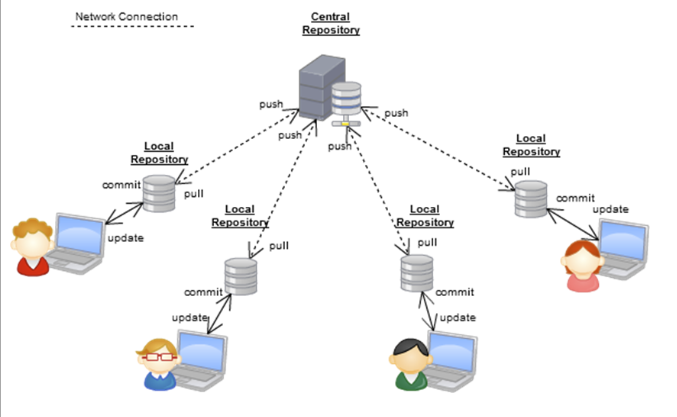

>## Archivácia súborov a správa verzii dokumentov

### 1. Prečo používať archiváciu súborov a správu verzii

Je to preto, lebo predmety *Aplikovaná informatika*, *Spracovanie dát na úrovni databázového servera* a *Spracovanie a vizualizácia dát* budú prebiehať v terminálovej učebni a ich výuka budeme intenzívne využívať jej technické a programové prostriedky. Naviac budeme pri výuke pracovať s veľkým množstvom učebných podkladov, pomocnej dokumentácie, odkazov, príkladov a pod. Pomocou nich budeme vytvárať naše vlastné dokumenty a súbory v ktorých si budeme individuálne precvičovať preberanú látku, vytvárať vlastné poznámky, skúšať alternatívne zápisy, riešiť individuálne a týmové úlohy a pod. Nuž a všetky tieto súbory, dokumenty, cvičenia a pod. si potrebujeme niekde a nejako uchovávať aby sme ich mali vždy podľa potreby k dispozícii pre neskoršie použitie a mohli z nich čerpať inšpirácie pre naše riešenia vbudúcnosti. A to všetko nezávisle od toho v ktorej terminálovej učebni sa budeme nachádzať a pri ktorom zariadení budeme pracovať resp. či tieto podklady budeme chcieť využiť aj mimo školského prostredia.

Obr. 1: Schéma HW prostriedkov LAN terminálovej učebne

Je to aj preto lebo z rôznych dôvodov sa nechceme obmedzovať iba na priesory a prostriedky školy, ale takýto prístup k uvedeným súborom a podkladom môže byť źiadaný aj po príchode domov, na internát či vo vlaku alebo na ulici. Vzniká teda potreba byť účastníkom novej počítačovej siete ktorej štruktúra môže vyzerať napr. takto:

Obr. 2: Oblastná počítačová sieť Wide Area Network (WAN) využivajúca výpočtové prostriedky rôzneho druhu

Implemntácia archivačného a **VCS** (**V**ersion **C**ontrol **S**ystems) systému predstavuje nadstavbu softwareového vybavenia siete alebo samostatných výpočtovách zariadení. Táto nadstavba nám umožní zapojiť sa aj do siete celosvetovej, čím okrem neobmedzeného prístupu a archivácie dát môžeme celosvetovo bezplatne využívať všetky jej služby tzv. GitCDN (**C**ontent **D**elivery **N**etwork) a získať [kontinuálnu integráciu](https://www.synopsys.com/glossary/what-is-cicd.html#:~:text=Continuous%20integration%20(CI)%20is%20practice,a%20reliable%20and%20repeatable%20way.) CI (**C**ontinuos **I**ntegration) všetkých jej účastníkov a kontinuálny prístup k ich dokumentom a súborom. 

Obr. 3: Celosvetová globálna internetová WAN 

Súčasťou tohoto vzájomného a neustáleho prepojenia ktoré je prístupné z ľubovolného miesta môžu byť okrem vývojových laboratórii, komerčných spoločností, škôl, domácich prostriedkov aj poskytovatelia sieťových služieb, sociálne siete a pod.

Obr. 3: Celosvetová internetová WAN s integráciou služieb a zdrojov

A v neposlednom rade je našim dôvodom pre to aby sme aj my používali tieto prostriedky a služby aj to že by sme neradi strácali čas nezáživnými a otravnými aktivitami ako je napr. písanie poznámok, alebo počúvanie monotónneho výkladu. Radšej by sme mali takýto čas využiť efektívnejšie a to aktivitami ktoré pritiahnu našu pozornosť a budú mať okamžitý a badatelný efekt. Skrátka nám pojde o to aby sme sa všetko naučili na hodine, aby sme každou minútou získavali počítačovú prax ktorá je priamo spojená s programovanim a aby sme čas po škole mohli venovať tréningu, športovému zápoleniu, regenerácii, relaxácii a zábave ! V niektorých prípadoch aj neustálemu hraniu počítačových hier, sledovaniu príspevkov na socialnych sieťach, sledovaniu filmových videi a pod.

Na druhej strane treba si však tiež uvedomiť aj to, že raz príde čas, keď pojde do tuhého resp. bude potrebné si konečne najisť aj trochu času pre vypracovanie projektov, opakovanie látky a samoštúdium. My si ako VCS systém ktorý už v sebe obsahuje aj archiváciu súborov zvolíme **Git** s **GitHub-om**. Tieto SW prostriedky a ich vzýjomné prepojenie nám ponúka pomoc ako sa dostať k informačným zdrojom, podkladom, súborom v ľubovolnom čase a z ľubovolného miesta.

### 2. Prečo Git a GitHub

Aké je dôvod k tomu že sme si spomedzi viacerých archivačných a VCS systémov zvolili práve Git a GitHub. Predovšetkým ten dôvod spočíva v rozsiahlej celosvetovej komunite ktorá tieto systémi používa (cca 100 miliónov užívateľov), potom obrovskému množstvu príspevkov ktoré ponúka (v roku 2022 to bolo 413 miliónov) a okrem ďalších predností a funkcii je táto platforma vzužívaná najmä vývojovými pracovníkmi ktrorí väčšinu svojich kódov sprístupňujú širokej verejnosti bez úhrady. A v neposlednom prípade ide o systém s ktorým sa s veľkou pravdepodobnosťou stretnete aj v praxi.

Práca v tejto sieti sa dá názorne zobraziť aj takto":

Predmetom tejto časti bude okrem inštalácie a nastavéní týchto programových prostriedkov aj zoznámenie sa ako s nimi pracovať aby sme vedeli uskutočňovať naše zámery. Na tomto mieste si jednotlivé činnosti iba názorne predstavíme a v ďalšom sa im budeme venovať podrobnejšie.

### 3. Čo znamenajú niektoré kľúčové pojmy

Úložisko (angl. **repository** ), alebo skrátene „repo“,je priestor kde sa ukladajú a sledujú verzie vašich súborov a projektov. Keď vykonáte zmeny v týchto súboroch, vložíte (alebo presuniete) tieto súbory do tohoto úložiska na úschovu. Rozlišujeme **local repository** ktoré sa nachádza na vašom pracovnom stroji a odkiaľ sa prenášajú súbory do centrálneho spravidla vzdialeného úložiska nazývaného **remote repository**. Medzi tým súbor prechádza určitými fázami spracovania SW git a github a na základe toho dosiahnu určité stavy ktrým zodpovedajú príslušné pomenovania. Jednotlivé stavy súborov môžeme vidieť aj vo VS-Code, kedy sú súbory na pravej strane označené príslušným symbolom (U, M, S):

Z hľadiska sledovania a uchávávania jednotlivých verzii súborov vzniká akýsi dieťový graf, ktorý môže mať aj nasledovnú podobu:

Predpokladajme, že kódová základňa je sada štyroch súborov s názvom Súbor-1, Súbor-2, Súbor-3 a Súbor-4. Takže, keď Developer-1 prevezme vetvu od mastra k vývoju funkcie-1 (predpokladajme, že Súbor-1 a Súbor-3 sa počas vývoja zmenia). Vývojár teda môže bezpečne odovzdať svoje zmeny na oboch súboroch do hlavnej vetvy **master**. A naopak, keď Developer-2 prevezme vetvu z mastra na vývoj funkcie-2 (predpokladajme, že File-2 a File-4 sa počas vývoja). Developer sa v tomto diagrame vlastne skrýva za vetvou resp. vĺaknom ktoré sa v Git-e označuje ako **branch**. Hlavná vetva je predvolene označená ako **master** a v súčasnosti bola premenovaná na **main**. Preto je často potrebne [príkazmi](https://www.linkedin.com/pulse/technology-notes-how-tos-infrastructure-git-master-main-eldritch) urobiť je premenovanie mastra na main a potom zmeniť predvolenú vetvu master an main. 
~~~
git branch --move master main 
git push -u origin main
~~~
Pre úplnosť treba ešte dodať že pojem **origin** vyjadruje skrátený názov vzdialeného úložiska, z ktorého bol projekt pôvodne klonovaný (preberaný do lokálu). Presnejšie povedané, používa sa namiesto adresy URL pôvodného úložiska – a preto je odkazovanie oveľa jednoduchšie.

Podrobnejš vysvetlenie niektorých ďalších pojmov nájdeme [**tu**](./Tahaky_dokumenty_obrazky/Vysvetlivky_terminov_Git.md)

### 4. Ako funguje proces archivácie a správy vezii

Úložisko uchováva zoznam všetkých vašich potvrdených (angl. commit-nutých) zmien, ktoré takto evidujú tzv. históriu potvrdzovania (angl. **commit history**) .
Git je populárna a široko používaná program pre správu verzií (VCS) pri ktorej používa na vytváranie a prácu s verziami  repository (úložiská). Git beží lokálne na vašom počítači a Git si môžete [tu stiahnuť](https://git-scm.com/), nainštalovať a používať na akejkoľvek platforme a bez akýchkoľvek nákladov a poplatkov. S Git-om si vytvoríte vaše lokálne úložisko v niektorom z vašich pracovných priečinkov ktorý používate pre odkladanie vašich súborov alebo vášho projektu. Git si potom v tomto priečinku ukladá aj históriu zmien na jednotlivých súboroch a všetky údaje ktoré sa viažu k súborom odovzdávaným do tohto priečinka resp. adresára (angl. file folder). Ako veľmi názorná forma úvodu do problematiky Git-u vám dobre poslúži aj vzhliadnutie tohto videa: https://youtu.be/hfOeWgWp__E
GitHub je na rozdiel od Git-u webová stránka, ktorá hosťuje vzdialené úložiská na internete. Základný účet na GitHub-e je tiež zadarmo. GitHub sa používa na vytvorenie vzdialeného úložiska pre verejný alebo regulovaný prístup záujemcov k súborom a projektom z lubovolného miesta a v ľubovolnom čase. Pomocou vzdialeného úložiska môžete ukladať svoje súbory a kódy mimo vášho pracoviska, spolupracovať s ostatnými, pracovať na školských, firemných alebo open source projektoch a predvádzať svoje portfólio potenciálnym zamestnávateľom. Obdobne ako veľmi názorná forma zoznámenia sa s problematikou GitHub-u vám veľmi dobre poslúži aj vzhliadnutie tohto videa: https://youtu.be/Uf2LLF7UKMw 

>#### Inštalácia Git-u a zmena mena hlavnej vetvy
Pred tým však ako prejdeme k používaniu Git a GitHub musíme si Git [stiahnut](https://git-scm.com/download/win) a nainštalovať na lokálnom počítači a pri GitHub-e sa musíme registrovať a vytvoriť si [účet](https://github.com/).

Ak urobíme inštalácia Git-u pomocou príkazov Git Bash v terminálovom okne VS-Code tak musíme uskutočniť nasledovné kroky:
1./ Presunieme sa do adresára ktorý chceme s jeho podadresármi a súbormi archivovať a ktorý tak bude local repository. Urobíme to pomocou linuxových príkazov 
        a/ ls - zobrazí nám kde sa nachádzame
        b/ cd meno_adresára - kam chceme prejísť
        c/ cd .. - vrátenie sa do predchádzajúceho adresára

2./ Zadáme príkaz ktorý nam vytvorí local repozitory a do adresára vloží .git a ukáze nám že sme na hlavnej vetve (master):
~~~
$ git init
~~~
3./ Zameníme meno hlavnej vetvy na main a zmeníme predvolenú vetvu na main:
~~~
git branch --move master main 
git push -u origin main
~~~

Teraz už sa môžeem pohybovať v spodnej časti tohoto obrázka t.j. použivať Git, vytvárať archiváciu a verie súborov nasledovnymi prikazmi:
~~~
$ git status    # zistenie stavu suborov
$ git add .     # priprava suborov ktore maju byt ulozene do archivu 
$ git commit -m "komentar k ukladanym suborom"  # ulozenie suborov do archivu   
~~~
>#### Registrácia na GitHub-e a vytvorenie účtu

Tu sa nachádza [webová adresa pre vytvorenie účtu na GitHub-e](https://git-scm.com/) ktorá nás privíta takýmto oknom.

Pri vytváraní vlastného účtu a repository na GitHub-e pre účely výuky je potrebné dodržať nasledovné pokyny:

* každý si vytvorí účet s nasledovným názvom priezviskom (prieyvisko a prvé písmeno mena napr. tokost)
* každý si vytvorí vlastné úložská s názvami predmetov bez velkých písmen, spodtržníkom medzi slovami, diakritiky,číslic a Špecialnych znakov ako napr aplikovana_informatika

Pri práci s Git a GitHub-om postupovať podľa
[zjednodušeného návodu práce s Git a GitHub v slovenčine](./Tahaky_dokumenty_obrazky/Archivácia_suborov_a_VCS.pdf) a v prípade nejasností respektíve odstraňovaní chýb použiť rozsiahlejší materiál v slovenčine ktorý sa nachádza [**tu**](./Tahaky_dokumenty_obrazky/Archivácia_suborov_a_VCS.pdf)

Súhrn základných príkazov opakovaného postupu pre **zápis súborov na lokal repository** možno chronologicky zoradiť nasledovne:

1./ **git status** - zistenie v akom stave sú súbory
2./ **add all** - príprava všetkých súborov na uloženie do lokálneho repository
3./ **git commit -m "komentár ...** -vlastné uloženie pripravených súborov do lokálneho repository
    
Pred zápisom na remote repository je potrebné urobiť jednorázovo dva úkony:
    a./ Vytvoriť prepojenie Git-u s GitHub-om tak že z GitHub-u si podľa obrázka nakopírujeme HTTPS
        
        a vložiť https do príkazu:
~~~
>$ git remote add meno_prezyvky-gh https://github.com/DeborahK/recipes.git
~~~
 kde **meno_prezyvky-gh** je prezývka (alias) v ktorej je vhodné nahradiť slovo meno_prezyvky svojim ľahko zapamätovatelným menom napr. tomo (a prezývka bude tomo-gh).
    b/ Nasleduje kontrola či to funguje pomocou príkazu ktorý nám vypíše všetky používané prezývky ako original, tomo-gh a pod.
~~~
$ git remote
~~~
Pre **sťahovanie z GitHub-u** na local repository potom opakovane používame príkaz:
~~~
$ git pull meno_prezyvky-gh main --allow-unrelated-histories

resp. po prvom použití stačí skratene 
$ git pull meno_prezyvky-gh main
~~~
a opačne pre zápis súborov na remote repository z local repository
opakovane používame spravidla po ukončení prac príkaz:
~~~
$ git push meno_prezyvky-gh main
~~~
Použivanie jednotlivých príkazov názorne približuje nasledovný obrázok

[Názorné video čo sa deje pri používaní základných príkazov](https://www.youtube.com/watch?v=UGkT8w91qXQ)

[SPÄŤ](../Obsah.md)