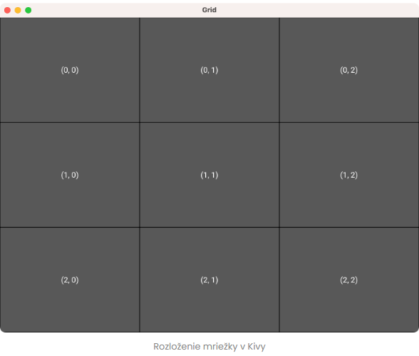
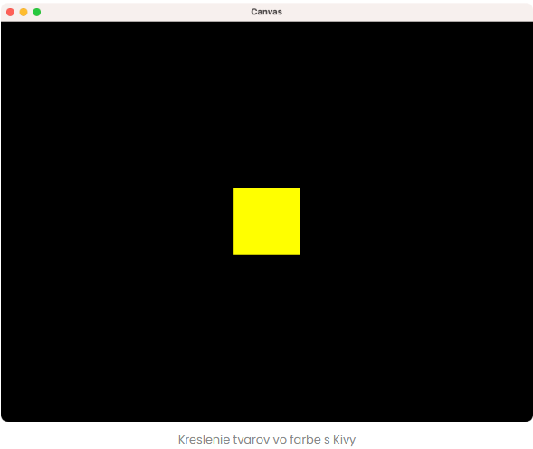

## GUI - grafické rozhranie s programom
GUI je súbor grafických ovládacích a zobrazovacích prvkov sústredených do frame (rámca) alebo okna ktoré slúži pre komunikáciu programu s jeho uživateľom. Uźívateľ svojím aktivovaním jednotlivých ponúkaných prvkov umiestnených vo frame tak tlmočí programu čo má robiť. GUI môžu byť súčasťou programových aplikácii ktoré napr. vytvárajú, čítajú, sťahujú a vymazávajú rôzne typy súborov či umožňujú hranie rôžnych hier alebo sú ponúkané ako internetové prehliadače, vývojové prostredia a pod. Bez nadsádzky možno povedať že dnes asi veľmi ťazko nájdeme SW ktorý nie je založený na GUI a preto ho aj každý užívateľ pri používaní nejakej aplikácie právom očakáva. 

Python ponúka pre GUI [veľké mámnožstvo knižníc](https://www.simplilearn.com/top-python-libraries-for-data-science-article), ktoré je možné vyhľadať pomocou [google](https://www.google.com/) ale uvedené štyri medzi nimi vynikajú:

* [Tkinter](https://www.youtube.com/playlist?list=PLCC34OHNcOtoC6GglhF3ncJ5rLwQrLGnV) 
* [Kivy](https://www.youtube.com/playlist?list=PLCC34OHNcOtpz7PJQ7Tv7hqFBP_xDDjqg) 
* [Python QT](https://wiki.python.org/moin/PyQt) či odvodená [PyQt5](https://www.youtube.com/watch?v=MOItX2aKTGc)
* [wxPython](https://www.youtube.com/watch?v=XVE673wsCEQ&list=PL1FgJUcJJ03vIgXI9BvOBdoc0S3PuzcRb)

S knižnicou Tkinter sme sa už stretli a dokonca sme už nazreli do postupov ako priradiť niektorým grafickým prvkom ich funkcionalitu. Tkinter je najpoužívanejšia knižnica Pythonu, ktorú možno použiť na vytváranie aplikácií základného grafického používateľského rozhrania (GUI).

### GUI s Tkinter
Keďže spôsob vytvorenia GUI okna už poznáme v tejto časti sa bude zaoberať už iba tzv. **widget**-ami čo je všeobené označenie pre ovládacie prvky.

#### Práca s widgetami
V pythone fungujú widgety podobne ako prvky [HTML](https://www.simplilearn.com/tutorials/html-tutorial/what-is-html). rôznym prvkom sú priradené v Tkinter rôzne funkcionality. Oficiálnu dokumentáciu k Tkinter widgetom nájdeme [tu](https://docs.python.org/3/library/tkinter.ttk.html) a najpoužívanejšie widgety spolu s príkadmi použitia nájdeme [tu](https://coderslegacy.com/python/list-of-tkinter-widgets/)

>Aj na tomto mieste v plnom rozsahu platí programátorská zásada že vytvárame iba taký kód ktorý nevieme najisť resp. nevieme modifikovať.

Keďže s knižnicou Tkinter a jej používaním sme sa už zoznámili budeme teraz venovať ešte pozornost Kivy.

Osetrovanie vstupov v Tkinter:
 https://pythonguides-com.translate.goog/tkinter/?_x_tr_sl=en&_x_tr_tl=sk&_x_tr_hl=sk&_x_tr_pto=wapp

tkinter data output:
https://www.google.com/search?q=tkinter+data+output&sxsrf=AB5stBiN9YxHPlMhIw1XGiTPYjNh7x1V-Q%3A1690751566901&ei=TtLGZPLHNvCK9u8PiqmOiAw&ved=0ahUKEwjyprG0rLeAAxVwhf0HHYqUA8EQ4dUDCBA&uact=5&oq=tkinter+data+output&gs_lp=Egxnd3Mtd2l6LXNlcnAiE3RraW50ZXIgZGF0YSBvdXRwdXQyBBAjGCdIh7UBUPgdWJOwAXACeAGQAQCYAYkBoAHIDaoBBDE3LjK4AQPIAQD4AQHCAgoQABhHGNYEGLADwgIHECMYsAIYJ8ICBRAAGKIEwgIFECEYoAHCAggQABiKBRiRAsICCBAAGIAEGMsBwgIFEAAYgATCAgoQABiABBgUGIcCwgIGEAAYFhgewgIIEAAYigUYhgPiAwQYACBBiAYBkAYI&sclient=gws-wiz-serp

Tkinter praca s databazou:
Zoznam metod wignetov v Tkinter:
https://www.plus2net.com/python/tkinter.php

### GUI s Kivy
Tkinter je oveľa priamočiarejší a ľahšie sa s ním začína a navyše je jeho knižnica zabudovaná do štandardného inštalačného balíka pythonu. Preto je jeho použitie vhodné najmä pre jednoduché programy. Kivy nám  ponúka väčšiu flexibilitu a podporu pre modilné zariadenia (s Androidom a IOS), ale je to za cenu komplikovanejšieho použitia. Jednou z oblastí, kde Kivy obzvlášť žiari, je vývoj hier. Kombináciou 2D prostriedkov Kivy s jednoduchým enginom môžeme vytvárať pôsobivé 2D simulácie a hry. Preto je vždy treba pre danú úlohu použiť ten správny nástroj. Nasledovné videá nám porovnávajú ([Tinter a Kivy](https://www.youtube.com/watch?v=5j-Fa-GSRII&t=122)). resp. [najpouźívanejšie]((https://www.youtube.com/watch?v=Q72b6tDQMKQ)) GUI knižníce.

#### Inštalácia a nastavenie Kivy

Inštalácia Kivy sa vykoná príkazom pip install kivy. Pri práci s knižnicami tretích strán je však dobrým zvykom vytvoriť virtuálne prostredie Python do zvoleného adresára (../GUI) čím zabezpečíme izoláciu nášho projektu od všetkého nepotrebného balastu. Používame k tomu nám už známy príkaz ktorý nám vytvorí virtuálne prostredie v adresári kivi_env:
~~~
$ python -m venv kivy_env
~~~
V ďalšom je potrebné toto prostredie aktivovať (C:/> .\kivy_env\Scripts\source activate), inštalovať do neho python ($ pip install python) a samotné kivy ($ python -m pip install kivy) 

#### Prvá aplikácia Kivy GUI v Pythone

Bez ďalších okolkov sa pustíme do vytvárania našej prvej aplikácie s Kivy a Pythonom. Pre túto aplikáciu použijeme objekt [Label](https://kivy.org/doc/stable/api-kivy.uix.label.html#module-kivy.uix.label) na zobrazenie tradičnej správy "Hello, World!" na našej obrazovke. Ak chcete napísať minimálnu aplikáciu Kivy GUI , musíme vykonať niekoľko krokov:
1. Importovať podtriedu [App][(](https://kivy.org/doc/stable/api-kivy.app.html#kivy.app.App))
2. Implementovať svoju metódu [build()](https://kivy.org/doc/stable/api-kivy.app.html#kivy.app.App.build) , ktorá vracia Widget inštanciu
3. Vytvorenie inštancie tejto triedy a zavolanie jej metódy [run()](https://kivy.org/doc/stable/api-kivy.app.html#kivy.app.App.run) 
Začnime importovaním požadovaných tried. Pre náš príklad potrebujeme iba triedy App a Label. Vytvorte si teda súbor Pythony s názvom app.py a pridajte nasledujúce importy:
~~~
from kivy.app import App
from kivy.uix.label import Label
~~~
Trieda App poskytuje základné funkcie potrebné na vytváranie aplikácií GUI s Kivy, ako je napríklad správa slučky udalostí. Medzitým Label bude trieda fungovať ako hlavný vizuálny prvok alebo widget pre naše GUI.

Ďalej môžeme vytvoriť našu podtriedu App. Tu sme ju nazvali MainApp. Môžete to však nazvať aj ináč ako sa nám to páči:
~~~
from kivy.app import App
from kivy.uix.label import Label

class MainApp(App):
    def build(self):
        return Label(text="Hello, World!")
~~~
Táto podtrieda používa koncept dedičnosti čím sa dostávame do oblasti objektovo orientovaného programovania (OOP) ktorým sa budeme venovať v následnom predmete. Toto je teda iba taká ochutnávka. Dedičnosť znamená že všetky atribúty a metódy definované v nadtriede App sú automaticky zdedené podtriedou MainApp.

Aby naša aplikácia vytvorila používateľské rozhranie, musíme definovať metódu build(). V build() vytvoríme a vrátime buď widget alebo rozloženie, ktoré bude koreňovým objektom v našej štruktúre používateľského rozhrania. Metóda build() je vstupným bodom k čomukoľvek, čo bude nakreslené na obrazovke. V našom príklade vytvorí a vráti štítok s textom "Hello, World!". Nakoniec musíme vytvoriť inštanciu MainApp a zavolať jej metódu run():
~~~
from kivy.app import App
from kivy.uix.label import Label

class MainApp(App): # konstrukcia OOP volana dole
    def build(self):
        return Label(text="Hello, World!")

MainApp().run()     # volanie MainApp
~~~
V poslednom riadku vytvoríme inštanciu MainApp a zavoláme jej run() metódu. Táto metóda spustí aplikáciu a spustí jej hlavnú slučku. To je všetko! Sme pripravení spustiť našu prvú aplikáciu Kivy. Otvorte príkazový riadok a spustite nasledujúci príkaz:
~~~
$ python app.py
~~~
alebo stlačte v okne šípku v pravo hore. **Pozor !** musíte mať ale nastavený python inštalovaný v kivy_env (viď. Ctrl+Shift+P: Python: Select interpreter)
#### Umiestnenie widgnet-v
V predchádzajúcej časti sme niekoľkokrát spomenuli widgety a ich umiestnenie. Možno sa ešte stále pýtate, čo to ten wignet vlastne je! **Widget** je prvok GUI, ktorý zobrazuje informácie alebo poskytuje špecifickú funkciu. Umožňujú použivateľom vašej aplikácie interakovať s GUI.

Rozloženie zase predstavuje spôsob usporiadania miniaplikácií do konkrétnej štruktúry v oknách vašej aplikácie. Rozloženie môže tiež poskytnúť určité správanie miniaplikáciám, ktoré k nemu patria, napríklad [ScatterLayout](https://kivy.org/doc/stable/api-kivy.uix.scatterlayout.html), ktorý umožňuje viacdotykovú zmenu veľkosti podradenej miniaplikácie atď.

V Kivy nájdete triedy miniaplikácií a rozloženia v ich zodpovedajúcom module pod modulom [kivy.uix](https://kivy.org/doc/stable/api-kivy.uix.html?highlight=uix#module-kivy.uix). Napríklad na import triedy Button môžeme použiť:
~~~
from kivy.uix.button import Button
~~~
V Kivy sa widgety a triedy rozloženia zvyčajne nachádzajú v moduloch pomenovaných po samotnej triede. Trieda však používa pre zápis mena tzv.[CamelCase](https://en.wikipedia.org/wiki/Camel_case) a modul zase používa pre zápis mena malé písmená. Vezmime si napríklad nasledujúce importy:
~~~
# Widgets
from kivy.uix.label import Label
from kivy.uix.image import Image

# Layouts
from kivy.uix.boxlayout import BoxLayout
from kivy.uix.floatlayout import FloatLayout
~~~
Pri tomto zaužívanom pomenovaní však platí niekoľko výnimiek. Napríklad:
~~~
from kivy.uix.image import AsyncImage
from kivy.uix.screenmanager import FadeTransition
~~~
Bežne sa to stáva pri moduloch, ktoré definujú viaceré a úzko súvisiace triedy, ako napríklad Image a AsyncImage.

#### Wignety zodpovedajú miniaplikáciam
Widgety sú stavebnými kameňmi GUI založených na Kivy. Niektoré z najčastejšie používaných miniaplikácií GUI v aplikáciách Kivy zahŕňajú nasledujúce:

* [Widget](https://kivy.org/doc/stable/api-kivy.uix.widget.html) je základná trieda potrebná na vytváranie miniaplikácií.
* [Label](https://kivy.org/doc/stable/api-kivy.uix.label.html) sa používa na vykresľovanie textu v oknách a dialógových oknách.
* [TextInput](https://kivy.org/doc/stable/api-kivy.uix.textinput.html) poskytuje pole pre upraviteľný obyčajný text.
* [Button](https://kivy.org/doc/stable/api-kivy.uix.button.html) spúšťa akcie, keď ho používateľ stlačí.
* [CheckBox](https://kivy.org/doc/stable/api-kivy.uix.checkbox.html) poskytuje dvojstavové tlačidlo, ktoré je možné zaškrtnúť alebo zrušiť.
* [Image](https://kivy.org/doc/stable/api-kivy.uix.image.html) sa používa na zobrazenie obrázka na vašich GUI.
* [ProgressBar](https://kivy.org/doc/stable/api-kivy.uix.progressbar.html) vizualizuje priebeh niektorých úloh.
* [DropDown](https://kivy.org/doc/stable/api-kivy.uix.dropdown.html) poskytuje všestranný rozbaľovací zoznam, ktorý môže obsahovať rôzne miniaplikácie.

Úplný zoznam widget-ov Kivy nájdeme [tu]()
Pomocou týchto miniaplikácií a niektorých ďalších, ktoré poskytuje Kivy, môžete vytvárať komplexné a užívateľsky prívetivé rozhrania pre vaše aplikácie.

#### Layout - rozloženie widgnetov
Kivy má tiež bohatú sadu tried rozloženia, ktoré vám umožňujú koherentne a funkčne usporiadať vaše miniaplikácie na vytváranie GUI. Niektoré príklady bežných rozložení zahŕňajú:
* [BoxLayout](https://kivy.org/doc/stable/api-kivy.uix.boxlayout.html#module-kivy.uix.boxlayout) usporiada widgety postupne vo vertikálnom alebo horizontálnom smere.
* [FloatLayout](https://kivy.org/doc/stable/api-kivy.uix.floatlayout.html#module-kivy.uix.floatlayout) usporiada widgety na konkrétnu pozíciu v okne, ktoré obsahuje.
* [RelativeLayout](https://kivy.org/doc/stable/api-kivy.uix.relativelayout.html#module-kivy.uix.relativelayout) usporiada detské widgety podľa relatívnych pozícií.
* [GridLayout](https://kivy.org/doc/stable/api-kivy.uix.gridlayout.html#module-kivy.uix.gridlayout) usporiada widgety do mriežky definovanej riadkami a stĺpcami.
* [PageLayout](https://kivy.org/doc/stable/api-kivy.uix.pagelayout.html#module-kivy.uix.pagelayout) vytvára viacstranové rozloženia spôsobom, ktorý umožňuje prechádzať z jednej strany na druhú.
* [ScatterLayout](https://kivy.org/doc/stable/api-kivy.uix.scatterlayout.html#module-kivy.uix.scatterlayout) umiestňuje svoje podradené widgety podobne ako RelativeLayout.
* [StackLayout](https://kivy.org/doc/stable/api-kivy.uix.stacklayout.html#module-kivy.uix.stacklayout) stohuje v poradí zľava doprava a potom zhora nadol alebo zhora nadol a potom zľava doprava.

Tieto rozloženia môžete kombinovať a spájať a vytvárať tak komplexné používateľské rozhrania.

#### Praktický príklad použitia widgnetov v rozložení
Ako príklad toho, ako používať widgety a rozloženia v Kivy, sa pozrime na bežne používanú triedu rozloženia: GridLayout. Pomocou tejto triedy môžeme vytvoriť mriežku riadkov a stĺpcov. Každá bunka mriežky má jedinečný pár súradníc založených na nule. Zvážte nasledujúci príklad:
~~~
from kivy.app import App
from kivy.uix.button import Button
from kivy.uix.gridlayout import GridLayout

ROWS = COLS = 3

class GridApp(App):
    def build(self):
        root = GridLayout(rows=ROWS, cols=COLS)
        for i in range(ROWS):
            for j in range(COLS):
                root.add_widget(Button(text=f"({i}, {j})"))
        return root

GridApp().run()V build()metóde vytvoríme inštanciu GridLayoutpomocou troch riadkov a troch stĺpcov. Potom použite forslučku na pridanie widgetov tlačidiel do rozloženia pomocou add_widget()metódy.
~~~
V metóde build() vytvoríme inštanciu GridLayout pomocou troch riadkov a troch stĺpcov. Potom použite forslučku na pridanie widgetov tlačidiel do rozloženia pomocou metódy add_widget(). Keď spustíme túto aplikáciu, dostaneme okno, ktoré je zobrazené nižšie:

Každé tlačidlo na mriežke zobrazuje zodpovedajúci pár súradníc. Prvá súradnica predstavuje riadok, zatiaľ čo druhá predstavuje stĺpec. Rovnako ako ostatné triedy rozloženia GridLayout môže mať niekoľko argumentov, ktoré môžete použiť na doladenie jeho správania.

#### Kreslenie útvarov 

Ak chcete do hĺbky prispôsobiť GUI alebo navrhnúť 2D videohru, možno budeme musieť nakresliť 2D tvary, ako je obdĺžnik, kruh, elipsa alebo trojuholník. V Kivy je to jednoduché. Knižnica poskytuje bohatú sadu tried tvarov, ktoré nájdete v kivy.graphicsbalení. Niektoré z týchto tried zahŕňajú:
* [Ellipse](https://kivy.org/doc/stable/api-kivy.graphics.html#kivy.graphics.Ellipse)
* [Line](https://kivy.org/doc/stable/api-kivy.graphics.html?highlight=graphics#kivy.graphics.Line)
* [Rectangle](https://kivy.org/doc/stable/api-kivy.graphics.html#kivy.graphics.Rectangle)
* [Triangle](https://kivy.org/doc/stable/api-kivy.graphics.html#kivy.graphics.Triangle)
  
Na nakreslenie tvaru na obrazovke pomocou Kivy musíme použiť Widget objektu s vlastnosťou canvas. Táto vlastnosť obsahuje inštanciu triedy Canvas, ktorá je umiestnená v knižnici kivy.graphics.
Pozrime sa, ako to funguje s príkladom bieleho štvorca nakresleného na obrazovke:
~~~
from kivy.app import App
from kivy.core.window import Window
from kivy.graphics import Rectangle
from kivy.uix.widget import Widget

class CanvasApp(App):
    def build(self):
        root = Widget()
        size = 200
        width, height = Window.size
        pos_x = 1/2 * (width - size)
        pos_y = 1/2 * (height - size)
        with root.canvas:
            Rectangle(size=[size, size], pos=[pos_x, pos_y])
        return root

CanvasApp().run()
~~~
Vnútri build() vytvoríme rootwidget a definujeme tvar size nášho útvaru. Bude to štvorcový tvar, takže každá strana je rovnaká. Ďalej vypočítame súradnice, aby sme náš tvar vycentrovali na okno. Súradnice odovzdané pri vytváraní tvaru sú pre ľavý horný roh okna. Aby sme vypočítali správne hodnoty, vezmeme width a height nášho hlavného okna, pričom tieto hodnoty rozdelíme na polovicu, aby sme získali stred. Potom odpočítame polovicu šírky alebo výšky nášho tvaru, aby sme umiestnili stred nášho tvaru do stredu okna. Dá sa to zjednodušiť na 1/2 * (width - size)alebo 1/2 * (height - size). Výsledné súradnice vľavo hore uložíme do pos_x a pos_y. Ďalej použijeme canvas nášho koreňového okna na kreslenie tvaru. Táto vlastnosť podporuje príkaz with, ktoré poskytuje vhodný kontext na vytváranie našich tvarov. Vo vnútri with bloku definujeme našu Rectangle inštanciu pomocou argumentov size a pos.Nakoniec podľa očakávania widget vrátime root-u. Posledný riadok kódu vytvorí inštanciu aplikácie a zavolá jej metódu run().

Predvolená farba je biela. Môžeme to však takto zmeniť:
~~~
# ...
from kivy.graphics import Color, Rectangle
from kivy.uix.widget import Widget
# ...

class CanvasApp(App):
    def build(self):
        # ...
        with root.canvas:
            Color(1, 1, 0, 1)
            Rectangle(size=[side, side], pos=[pos_x, pos_y])
 # ...
~~~
V tomto úryvku kódu sme pridali import pre Colortriedu z graphicsbalíka. Trieda Colorakceptuje štyri číselné argumenty medzi 0a 1reprezentujúce červenú, zelenú, modrú a priehľadnú zložku našej cieľovej farby.

Napríklad hodnoty (1, 0, 0, 1)predstavujú úplne červenú a úplne nepriehľadnú farbu. Hodnota (0, 1, 0, 0.5)je úplne zelená, napoly nepriehľadná a napoly priehľadná. V dôsledku toho hodnota (1, 1, 0, 1)dáva úplne nepriehľadnú žltú farbu. Ak teda spustíte aplikáciu, získate nasledujúci výstup:

Nakoniec si všimnite, že ak chcete vidieť účinok Color() na nakreslený obdĺžnik, trieda Color musí byť vytvorená pred triedou Rectangle. Môžete si to predstaviť ako namáčanie štetca na paletu farieb pred použitím na maľovanie na plátne! Je zaujímavé, že každá kresba, ktorá príde po inštancii Color, je namaľovaná podľa toho, pokiaľ nebola použitá iná farba.

Používanie príkazu with je veľmi pohodlné a uľahčuje prácu s tvarmi. Prípadne môžeme použiť metódu canvas.add():
~~~
root.canvas.add(Color(1, 1, 0, 1))
root.canvas.add(
    Rectangle(size=[side, side], pos=[pos_x, pos_y])
)
~~~
#### Použitie jayzika Kivy

Kivy nám pri tvorbe nášho GUI poskytuje deklaratívny jazyk označený ako [jazyk Kv](https://kivy.org/doc/stable/guide/lang.html). Tu sa s ním nebudeme podrobnejšie zaoberať a vyzdvihneme iba niektoré jeho hlavné vlastnosti a silné stránky.
Pomocou jazyka Kv deklarujeme a štilizujeme widgety a grafické komponenty nášho GUI návrhu. Svoj Kv kód vložíte do súborov s príponou .kv (meno_suboru.kv). Potom načítame obsah týchto súborov do svojej aplikácie a vytvoríme tým naše GUI. Načítať obsah súboru meno_suboru.kv môžeme dvomi spôsobmi:
* Spoľahneme sa na na automatický mechanizmus načítania
* Použijeme tzv. Builder triedy a vykonáme manuálne načítanie
V nasledujúcich častiach sa naučíme základy týchto dvoch spôsobov použitia jazyka Kv na vytvorenie GUI vašich aplikácií Kivy.

>#### Automatické načítanie widgnetov

Ako už bolo uvedené, jazyk Kv vám pomáha oddeliť logiku ostatného kódu od návrhu grafického používateľského rozhrania. Ukážme si to na aktualizovanej verzii našej aplikácie s "Hello, World!":
~~~
# kivi_auto.py

from kivy.app import App
from kivy.uix.label import Label

class CustomLabel(Label):   # vytvorenie novej triedy
    pass

class MainApp(App):   
    def build(self):
        root = CustomLabel()    # volanie novej triedy
        return root

MainApp().run()
~~~
Ako vidieť k triede MainApp sme vytvorili novú, triedu CustomLabel ktorá voči triede Label vystupuje ako jej podtrieda. Nevykonali sme tu žiadne úpravy, takže funguje presne ako trieda Label len s iným názvom. Pridáme do nej iba príkaz Pythonu pass aby sme dodržali požidavky syntaxe. Potom vytvoríme nový súbor s názvom **main.kv** v ktorom definujte štítok pomocou nasledujúceho kódu:
~~~
<CustomLabel>:
    text: "Hello, World!"
~~~
Štítok musí mať rovnaký názov (CustomLabel) ako má vaša nová trieda v aplikácii. Okrem toho súbor .kv musí mať rovnaký názov ako vaša podtrieda App, avšak bez prípony App a s malými písmenami. V tomto príklade je vaša podtrieda pomenovaná MainApp, takže váš .kv súbor musí mať názov main.kv. Teraz môžete spustiť aplikáciu kivi_auto.py a na obrazovke sa zobrazí daný text.

Jazyk Kv, je tiež známy ako kivy language alebo len kvlang, a umožňuje nám deklaratívnym spôsobom ytvárať stromy widgetov. Umožňuje nám však tiež navzájom alebo so spätnými volaniami spájať vlastnosti miniaplikácii.

>#### Načítanie miniaplikácii pomocou Builder-u

Čím väčším je projekt GUI s Kivy tým väší bude v princípe aj súbor .kv . Preto sa odporúča rozdeliť kvôli čitateľnosti tento súbor do rôznych samostatnývh .kv súborov. V takýchto prípadoch kedy použijeme viacero .kv súborov už mechanizmus automatického načítania nebude postačujúci. Budeme musieť použiť Builder ktorý predstavuje kivy triedu lang.BuilderBuilder.

Aby sme si ukázali, ako používať Builder, zostavme vzorové GUI pozostávajúce z označenia a tlačidla v BoxLayout. Štítok bude vytvorenź v súbore labels.kv, zatiaľ čo tlačidlá zostanú v súbore buttons.kv.
~~~
from kivy.app import App
from kivy.lang import Builder
from kivy.uix.boxlayout import BoxLayout
from kivy.uix.button import Button
from kivy.uix.label import Label

Builder.load_file("labels.kv")
Builder.load_file("buttons.kv")

class CustomLabel(Label):
    pass

class CustomButton(Button):
    pass

class MainApp(App):
    def build(self):
        root = BoxLayout(orientation="vertical")
        root.add_widget(CustomLabel())
        root.add_widget(CustomButton())
        return root

MainApp().run()
~~~
Okrem použitia Builder.load_file(meno_suboru.kv) na vytváranie jazykových súborov Kv môžete tiež načítať jazyk Kv priamo vo forme viacriadkového reťazca do nášho súboru:
~~~
Builder.load_string("""
<CustomLabel>:
    text: "This is a custom label!"
    font_size: 50
    bold: True
""")
Builder.load_string("""
<CustomButton>:
    text: "Click me!"
""")
~~~
Posledný príkladom použitia jazyka Kv bude kreslenie tvarov. Vytvorte rectangle.py súbor s nasledujúcim obsahom:
~~~
# rectangle.py

from kivy.app import App
from kivy.uix.widget import Widget

class CustomRectangle(Widget):
    pass

class MainRec(App):
    def build(self):
        return CustomRectangle()

MainRec().run()
~~~
V rovnakom adresári vytvoríme ďalší súbor a uložíme ho ako mainrec.kv. Potom pridáme nasledujúci obsah:
~~~
<CustomRectangle>:
  canvas:
    Color:
      rgba: 1, 1, 0, 1
    Rectangle:
      size: 200, 200
      pos: 0, 0
~~~
Ďalšie pokyny na používanie jazyka Kv nájdete v jeho oficiálnej [dokumentácii](https://kivy.org/doc/stable/api-kivy.lang.html#module-kivy.lang) Ďalšie príklady toho, čo môžete robiť s Kivy, nájdete v dokumentácii v sekcii [Príklady Kivy](https://kivy.org/doc/stable/examples/). Ak máte záujem o 3D, [ukážka Kivy 3D](https://kivy.org/doc/stable/examples/gen__3Drendering__main__py.html) je dobrou ukážkou vykresľovacích schopností rámca.
Ak máte záujem používať Kivy na vývoj pre vývoj aplikácie na mobilné zariadenia, môžete písať funkčné aplikácie pre Android (APK) pomocou jazyka Python a zabaliť ich pomocou nástrojov ako [Buildozer](https://buildozer.readthedocs.io/en/latest/) ([video](https://www.youtube.com/watch?v=pzsvN3fuBA0)) a [Python-For-Android](https://python-for-android.readthedocs.io/en/latest/) To všetko bez toho, aby ste sa učili Javu ktorá je najrozšírenejším programovacím jazykom pre tieto aplikácie.
Ak chcete úplnú víziu toho, kde môžete Kivy použiť, pozrite si [galériu príkladov](https://kivy.org/gallery.html) poskytnutých komunitou Kivy.

Obdobné návody ako postupovať pri tvorbe GUI nájdeme aj pre knižnicu [PyQt5](https://www-pythonguis-com.translate.goog/pyqt5-tutorial?_x_tr_sl=en&_x_tr_tl=sk&_x_tr_hl=sk&_x_tr_pto=wapp), [PyQt6](https://www-pythonguis-com.translate.goog/pyqt6-tutorial?_x_tr_sl=en&_x_tr_tl=sk&_x_tr_hl=sk&_x_tr_pto=wapp) alebo [PySide2](https://www-pythonguis-com.translate.goog/pyside2-tutorial?_x_tr_sl=en&_x_tr_tl=sk&_x_tr_hl=sk&_x_tr_pto=wapp), [PySide6](https://www-pythonguis-com.translate.goog/pyside6-tutorial?_x_tr_sl=en&_x_tr_tl=sk&_x_tr_hl=sk&_x_tr_pto=wapp) a ďalšie.

[SPÄŤ](../../../Obsah.md)