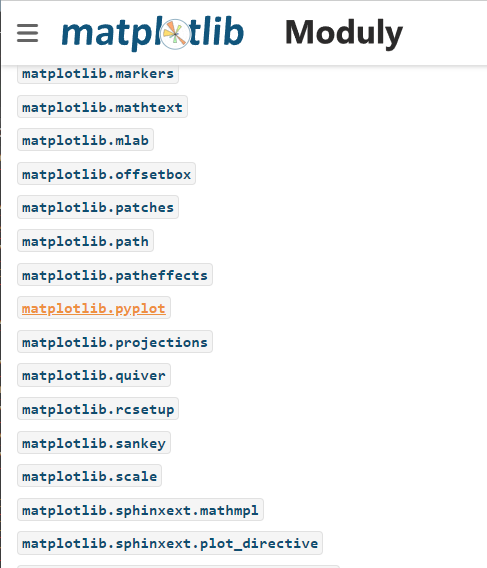
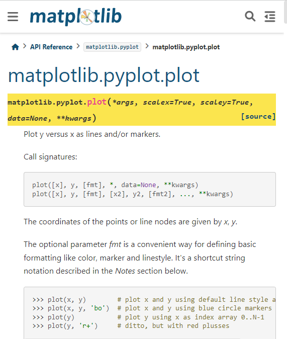
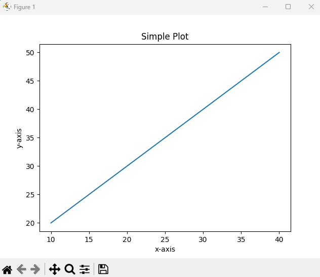

>## Knižnice Pythonu so svojími modulmi

Možno si to neuvedomujete, ale už ste mali do činenia s niektorými najpopulárnejšími knižnicami Pythonu. Vybral som ich z rôznych domén (internetových zdrojov), aby som vám ukázal, aký je Python rozšírený. Python môžete použiť napr. v dátovej vede, IoT (Internet of Thing) aplikáciách využívajúcich internet, umelej inteligencii, vývoji webu, či riešení špecifických úloh ako napr. v oblasti športu, vývoji hier a pod. Ak vám táto skutočnosť pomôže zvýšiť záujem o Python bude to iba dobré a možno to niekedy v nejakej podobe vo vašom profesionálnom živote aj využijete.

Keď sa už z nejakého dôvodu rozhodnete učiť Python, mali by ste si starostlivo vyberať učebné materiály. Na učenie Pythonu je k dispozícii vbeľké množstvo zdrojov, ktoré môžu mať rôzny obsah alebo rozsah. To môže byť výhodou alebo aj nevýhodou pri výbere tej správnej a najúčinnejšej dokumentácie. **Kľúčom je dobre štruktúrovaný a organizovaný materiál** ku ktorému by vám mali umožniť prístup vaši učitelia alebo experti-praktici (guru) na python.

Ďalšou veľmi dôležitou nutnosťou  je praktické precvičovanie, ktorého by malo byť čo najviac. Je to základná požiadavka učenia a v plnom rozsahu platí aj pre učenie sa pythonu. LEARNPYTHON.COM ponúka starostlivo navrhnuté kurzy a spôsoby s interaktívnou online konzolou, ktorá vám umožní trénovať programovanie, až kým sa to učíte. Náš zámer NAUČIŤ SA PROGRAMOVAŤ S PYTHONOM by vám mal pomôcť získať komplexné pochopenie základov Pythonu a počítačového programovania.

Ďalšia veľmi dôležitá vec, ktorú treba mať na pamäti, je konzistencia (vytrvalosť). Keď sa učíte Python alebo akýkoľvek iný programovací jazyk, snažte sa nerobiť dlhé prestávky. Kódujte každý deň, aj keď je to len na pár minút. Zachováte si viac, ako by ste sa učili dlhé hodiny a potom si dali dlhú pauzu. Tu je zoznam 5 SKVELÝCH TIPOV, AKO SA NAUČIŤ PYTHON OD ZAČIATKU .

Pri každom učení a používaní programoacieho jazyka sa nevyhnete jeho **knižniciam** ktoré vám pomáhajú pracovať resp. **programovať efektívnejšie a rýchlejšie**.

Tu máme napr. 10 základných knižníc Pythonu pre dátových vedcov:
https://hashdork.com/sk/python-kni%C5%BEnice-pre-d%C3%A1tov%C3%BDch-vedcov/

Alebo knižnice pre matematiku math a random najdeme tu:
https://www.itnetwork.sk/python/zaklady/python-tutorial-kniznice-math-a-random

Vizualizáciu grafov a pod. najdeme v knižnici Matplotlib:
https://magazin.kpi.fei.tuke.sk/2019/02/spracovanie-dat-a-ich-vizualizacia-pouzitim-kniznic-jazyka-python/

Pre fanúšikov počitáčových hier sú určené knižnice:
https://pygame-zero.readthedocs.io/sk/latest/introduction.html

Alebo rôzne API (Applicatin Programing Interface) frameworky (rámce) zase nájdeme tu:
https://denshub.com/sk/best-framework-to-build-api/

Bioinformatika:
https://microbiologynote.com/sk/programovac%C3%AD-jazyk-python-v-bioinformatike/?utm_content=cmp-true

Robotika - IoT knižnica octopus na obsluhu hardvéru a komunikácie:
https://robodoupe.cz/2019/iot-prakticky-python-na-esp32-iv-kniznica-octopus-na-obsluhu-hardveru-a-komunikacie/

10 najlepších knižníc Python, ktoré sa doporučovali poznať v roku 2023:
https://www.edureka.co/blog/python-libraries/

Alebo si môžete vyGoogle aktuálne ponuky pomocou kľúčových slov "list of most popular python libraries"

Ako vidíte **Python je oceán knižníc**, ktoré slúžia na rôzne účely a ako vývojár v Pythonu by ste sa mali zaujímať o možnosti ktoré vám knižnice poskytujú a mali by ste mať znalosti o tých najlepších. Aby sme veci zadosťučinili tu je článok, ktorý vám prináša 10 najlepších knižníc Pythonu pre strojové učenie, ktoré sú:

TensorFlow
Scikit-Learn
Numpy
Keras
PyTorch
LightGBM
Eli5
SciPy
Theano
pandy

Top 10 Python Libraries
https://www.interviewbit.com/blog/python-libraries/

24 Best Python Libraries You Should Check in 2023
https://hackr.io/blog/best-python-libraries

20 Must-Have Python Libraries for Data Science in 2023
https://www.simplilearn.com/top-python-libraries-for-data-science-article

9 Best Python Libraries for Machine Learning
https://www.coursera.org/articles/python-machine-learning-library

Top 10 Python Libraries You Must Know In 2023
https://herovired.com/learning-hub/blogs/python-libraries/

The 30 Most Useful Python Libraries for Data Engineering
https://odsc.medium.com/the-30-most-useful-python-libraries-for-data-engineering-ec9aa91176ba

Best Python Libraries for Every Python Developer
https://towardsdatascience.com/best-python-libraries-for-every-python-developer-77daab4fa40e

SKRÁTKA **AK IDETE NIEČO RIEŠIŤ**, TAK BY MAL BYŤ **PRVÝ KROK** TO ŽE SI CEZ Google ALEBO EŠTE LEPŠIE CEZ ChatGPT SKÚSITE **NAJISŤ KNIŽNICU KTORÁ PONÚKA FUNKCIE POUŽITELNÉ PRE RIEŠENIA VÁŠHO PROBLÉMU**. AŽ KEĎ ŽIADNU KNIŽNICU NENÁJDETE NIČ VÁM NEZOSTANE ABY STE DANÝ PROBLÉM RIEŠIL KONŠTRUKCIOU SVOJHO KÓDU.

Najlepšie knižnice Pythonu pre strojové učenie
https://www.geeksforgeeks.org/best-python-libraries-for-machine-learning/

Nakoniec uveďme príklad použitia knižnce z oblasti vytvárania grafov ktorá je aj vo vašich podmienkách veľmi aktuálna.

Táto knižnica sa vola [**Matplotlib**](https://matplotlib.org/3.1.1/gallery/index.html) a obsahuje moduly ktorých zoznam nájdeme [**tu**](https://matplotlib.org/3.1.1/api/index.html). 

Z príslušného modulu ktorému sme dali názov **plt** si  vyberieme funkciu **plot** ktorú použijeme v našom kóde pomocou bodkového zápisu  **plt.plot(x,y)**. Predpokladom je ale že knižnica bude najprv nainštalovaná príkazom **pip install matplotlib**: 
~~~
import matplotlib.pyplot as plt 

# initializing the data 
x = [10, 20, 30, 40] 
y = [20, 30, 40, 50] 

# plotting the data 
plt.plot(x, y) 

# Adding the title 
plt.title("Simple Plot") 

# Adding the labels 
plt.ylabel("y-axis") 
plt.xlabel("x-axis") 
plt.show()
~~~

Ďaľšie príklady použitia Matlibplot nájdeme [**tu**](https://www.geeksforgeeks.org/matplotlib-tutorial/)
[SPÄŤ](../../Obsah.md)