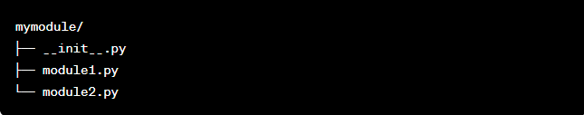
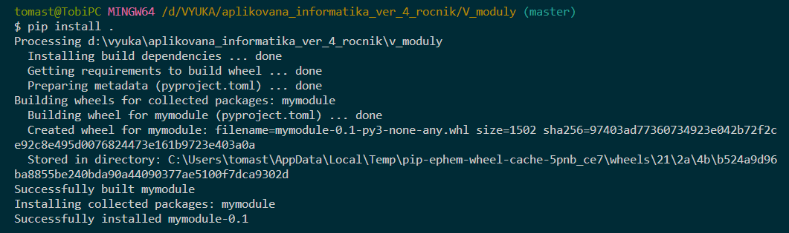

>## Redistribuovatelé moduly

Doposiaľ sme moduly alebo využívali z existujúcich knižníc, alebo sme si ich vytvárali pre svoju vlastnú potrebu. Pokiaľ sa však rozhodneme naše **moduly poskytnúť širokej verejnosti** t.j. distribúcii musíme splniť niekoľko požiadaviek o ktorých budeme pojednávať práve na tomto mieste. Podrobnosti o tom ako vytvoriť opakovane použiteľný t.j. redistribuovateľný modul sa dozvieme v nasledovnom [dokumente](https://naucse.python.cz/lessons/intro/distribution/). To ako sa potom takéto moduly inštalujú sme si už viac krát ukázali ale napriek tomu ešte jeden [odkaz](https://mamut.spseol.cz/nozka/python/moduly/) z oblasti vedecky orientovaných distribúcii.

>### Časté otázky o moduloch Python

Pozrime sa na niektoré často kladené otázky týkajúce sa modulov Pythonu.

**1./ Aké sú vstavané moduly (pozor nie vstavané funkcie) v Pythone ?**

V Pythone je veľa vstavaných modulov (builld-in). Niektoré z dôležitých sú - čas (time). Môžete spustiť príkazy nižšie a dostaneme ich zoznam:
~~~
from stdlib_list import stdlib_list

libraries = stdlib_list("3.11") # zadanie verzie pythonu

print(libraries[0:])
~~~

**2./ Aký je rozdiel medzi modulom a balíkom** - t.j. knižnicou v Pythone ?

**Balík v Pythone je zbierka modulov pythonu t.j. viacero súborov**. **Modul v Pythone je iba jeden súbor pythone**. Balík v pythone je adresár s viacerými skriptami pythonu a súborom __init__.py ktorý definuje podrobnosti balíka.

**3./ Kde nájdem zoznam modulov Pythonu ?**

Zoznam modulov Python nájdete na ich [oficiálnej stránke indexu modulov Python](https://docs.python.org/3/py-modindex.html). Ak však hľadáte iba **moduly** Pythonu, **ktoré máte lokálne dostupné k dispozícii**, môžete spustiť 
~~~
>>>dir (__builtins__)

alebo s dokumentáciou

>>>help (__builtins__)
~~~

**4./ Kde nájdem zoznam balíkov - knižníc Pythonu ?**

Jedným z najvýznamnejších zdrojov je toto [úložisko GitHub](https://github.com/vinta/awesome-python), kde nájdete zoznam najdôležitejších modulov pythonu spolu s celou radou dokumentačných materiálov, návodov a vzorových príkladov ktoré vám pomôžu danú problematiku zvládnuť a implementovať do vašich aplikácii.

**5./ Ako môžem importovať modul z iného adresára ?**
Keď sa pokúšame importovať modul python, pozrie sa do aktuálneho adresára a umiestnenia premennej PATH. Ak sa teda váš **python súbor nenachádza** v týchto miestach, dostanete **ModuleNotFoundError**. **Riešením je importovať modul sys (import sys) a potom pridať požadovaný adresár do jeho premennej na vyhľadávanie cesty** Je to však riešenie ktoré je v každom volajúcom súbore znovu vyvolať. V príkladoch test2a.py, test2b.py a test2c.py uvádzame niekoľko variantov ako to vykonať. Nižšie uvedený kód zobrazuje chybu, keď sa pokúšame importovať z iného adresára a ako to opravujeme pridaním jeho adresára do premennej cesty. V príklade chceme importovať modul test3.py ktorý sa nachádza v adresári c:/users/tomast/temp:
~~~
# c:/users/tomast/temp/test3.py

x=10
~~~
Tento modul volame v programe test2.py kotrý sa nachádza v úplne inom adresári a ktorý obsahuje kód:
~~~
import test3

print(test3.x)
~~~
ktorý ným vypíše chybu 
~~~
Traceback (most recent call last):
  File "d:\VYUKA\aplikovana_informatika_ver_4_rocnik\V_MODULY\test2.py", line 1, in <module>
    import test3
ModuleNotFoundError: No module named 'test3'
~~~

Použitie sys.path sa zvyčajne vykonáva na pridanie adresárov do vyhľadávacej cesty modulu Python. To je užitočné, keď chcete importovať moduly z adresárov, ktoré nie sú súčasťou predvolenej cesty Pythonu. Nasledujúce obrázky ozbrazujú tri varianty (test2a.py, test2b.py a test2c.py) ako to urobiť:
~~~
# test2a.py

import sys
# Adjust the path accordingly
sys.path.append('c:/users/tomast/temp/')

import test3
print(test3.x)

~~~
~~~
# test2b.py

import sys
# Adjust the path accordingly
sys.path.append('c:/users/tomast')

import temp.test3
print(temp.test3.x)
~~~
~~~
# test2c.py

import sys
sys.path.append('c:/users/tomast')

from temp import test3
print(test3.x)
~~~

Keď použijetefrom temp import test3,sys.path.__init__.pysúbor, ktorý sa má rozpoznať je *test3.py* nachádzajúci sa v adresári *C:/users/tomast/temp*. Ak problémy pretrvávajú, uistite sa, že adresár 'temp' obsahuje súbor __init__.py a test3.py.

**6./ Použitie balíka pri importovaní modulu z iného adresára ?**
Keď sa pokúšame importovať modul, python sa pozrie do aktuálneho adresára a do obsahu premennej PATH. Ak sa teda váš python súbor nenachádza v týchto umiestneniach, dostanete chybu *Module Not FoundError*. V takomto prípade by som uprednostňoval systémové riešenie ktoré sa vyhýba hľadaniu molu po celom počítači a vždy pojde z ľubovolného adresára do adresára pod názvom *mymodule* kde budú uložené všetky naše moduly:

Toot riešenie pre začiatok okrem vytvorenia adresára *mymodule* vyžaduje nasledovný postup:

1./ **Vytvoríme si svoj adresár ako balík** so špeciálnym súborom s názvom __init__.py v ňom. Tento súbor môže byť prázdny, ale jeho prítomnosť signalizuje Pythonu, že s adresárom by sa malo zaobchádzať ako s balíkom.

2./ **Nainštalujte balík** pomocou *setuptool* čím ho sprístupníme a to tak že v rovnakom adresári kde máme naše moduly na úrovni *mymodule* vytvoríme súbor **setup.py** s týmto obsahom:
~~~
from setuptools import setup

setup(
    name='mymodule',
    version='0.1',
    packages=['mymodule'],
)
~~~
Keď následne prejdeme do nášho adresára ktorý obsahuje setup.py a spustíme príkaz:
~~~
$ pip install .
~~~
Tak sa nainštaluje náš balík lokálne.

3./ **Ak pracujeme vo virtuálnom prostredí** ktoré sme si vytvorili príkazom
~~~
$ python -m venv venv
~~~
a aktivovali príkazom
~~~
$ . venv\Scripts\activate
~~~
a budeme chcieť aby náš modul bol prístupný odkiaľkoľvek, možno budete chcieť do systémovej cesty *PATH* pridať adresár virtuálneho prostredia Scripts (pre WIndows) alebo bin (pre Linux). To je však iba vlitelné.
4./ **Overenei funkčnosti** v sebe obsahuje otestovanie dostupnosti nášho modulu tak, že sa ho pokúsime importovať do pythonovského programu nachádzajúcemu sa v ľubovolnom adresári.
~~~
import mymodule.module1
~~~
Ak ste postupovali podľa týchto krokov, váš modul Python by mal byť po nainštalovaní dostupný odkiaľkoľvek. Majte na pamäti, že ak chcete svoj modul zdieľať s ostatnými, môžete zvážiť jeho zverejnenie v indexe balíkov Python (PyPI) a zdieľanie inštalovateľného balíka namiesto jeho ručnej distribúcie.

>### Zoznam modulov Pythonu

**Existujú tisíce modulov Pythonu** a každý deň sa vyvíjajú ďalšie. Už bolo napísaných veľmi veľa modulov a návodov Pythonu ktoré sa stali populárnymi. Ak by ste chceli poznať tieto moduly, postupujte podľa odkazov pod tabuľkou. Tu ej príklad niektorých z nich:

Python Modules
Python os module
Python sys module
Python time
Python MySQL
Python CSV
Python multiprocessing
Python pickle
Python time sleep
Python queue
Python unittest
Python socket
Python SimpleHTTPServer
Python json
Python signal
Python random
Python System Command
Python Daemon Thread
Python Copy
Python threading module
Python struct
Python logging
Python subprocess
Python argparse
Python functools
Python itertools
Python getopt
Python ftp
Python tarfile
Python lxml
Python ConfigParser
Python datetime
Python decimal module
Python collections
Python zipfile
Python pdb
Python io
Python fractions
Python AST
Python HTTP
Python xmltodict
Python gzip
Python HTML Parser
Python inspect module
Python Send Email
Python tempfile
Python SQLite
Python shutil
Python timeit
Python getpass module
Python urllib
Python pytz
Python pendulum
Python arrow module
Referencie:

https://docs.python.org/3/tutorial/modules.html
https://docs.python.org/3/py-modindex.html

[SPÄŤ](../../Obsah.md)